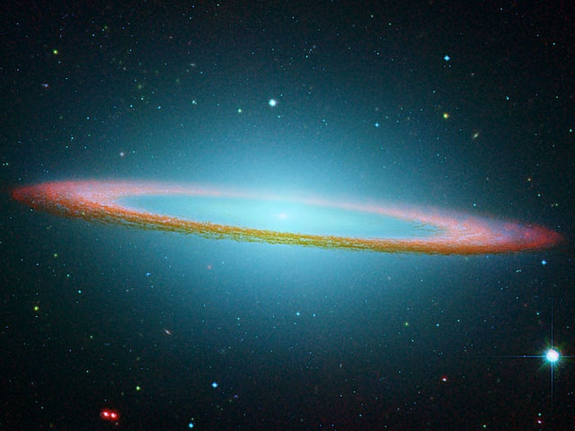

Le blog "[Parcours Etranges"](http://strangepaths.com/fr/) sous-titré "Physique, calcul et philosophie" est l'un de mes préférés peut-être parce qu'il cause de certaines choses que l'on trouve aussi sur Dr. Goulu comme:

- "[Cristaux d'eau](http://strangepaths.com/cristaux-deau/2007/02/01/fr/)" sur les [flocons de neige](http://drgoulu.local/2007/01/23/il-neige-de-beaux-flocons/)
- le prodigieusement complet et bien documenté article intitulé "[Arche Interstellaire](http://strangepaths.com/arche-interstellaire/2007/02/14/fr/)" qui décrit par le menu diverses solutions au voyage interstellaire, parmi lesquelles le voyage à vitesse relativiste décrit dans ma nouvelle "[Accélération](http://drgoulu.local/2004/08/09/acceleration/)". "Gilgamesh", tu peux écrire un bouquin sur la base de ton article, j'achète.
- De magnifiques photos d'astronomie comme celle-ci qui sert de bannière à [Parcours Etranges":](http://strangepaths.com/fr/)

 en lumière infrarouge")

 en lumière infrarouge")

 en lumière infrarouge")

[La Galaxie M104 dite du "Sombrero" en lumière infrarouge](http://strangepaths.com/galaxie-m104-en-lumiere-infrarouge/2007/01/23/fr/)
