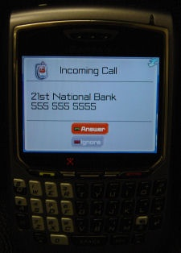

Vous vous êtes habitué à voir sur votre téléphone portable ou fixe l'identité ou le numéro de l'appellant ? Vous dites "salut ma chérie" ou "bonjour chef" au lieu de "allo ?" Vous laissez sonner les "numéro inconnu" ? Il va falloir vous déshabituer !

Dans l'article en anglais [In Security: 3 Ways To Protect Against Caller ID Spoofing,](http://authentium.blogspot.com/2007/06/3-ways-to-protect-against-caller-id.html) j'ai appris qu'il est non seulement techniquement possible de truquer son numéro appelant ("caller ID"), mais même que c'est à la portée de tout le monde "grâce" à des services payants du genre de "[Spoof Card](http://www.spoofcard.com/)" dont le slogan "Be who you want to be" et la liste des services proposés fait dresser les cheveux sur la tête:

- Truquage du numéro appelant
- Changeur de voix (on peut changer notre voix de sexe, entre autres...)
- Enregistrement de la conversation

tout ça dès $10 pour 1h de conversation ! La bonne nouvelle c'est que ça ne marche qu'aux USA, la mauvaise qu'ils cherchent des distributeurs ailleurs.

L'article mentionne 3 mesures à prendre pour se protéger contre ce genre de "service":

1. protéger sa boite vocale (ComBox pour les suisses) par un mot de passe. Sinon, quelqu'un peut appeler votre boite en utilisant votre numéro de portable comme numéro d'appelant, et écoute vos messages. Vous pouvez aussi systématiquement effacer vos messages lus importants ou confidentiels, car sinon ils restent dans les archives de votre boite vocale.
2. ne transmettre des informations (bancaires, adresse, etc) qu'à des personnes dont vous reconnaissez la voix. Dans quelques années, même ça ne sera plus suffisant donc il faudra lui poser des questions pour l'identifier. Le plus simple est de dire qu'on rappelle, prendre le temps de réfléchir et de vérifier, puis rappeler le numéro pris d'un annuaire
3. ne jamais appeler des numéros figurant dans des e-mails censés provenir de banques etc.

A un certain moment du XXIème siècle, ça sera plus court de faire la liste des technologies auxquelles on peut se fier (arc et flèches et quelques autres) plutôt que de celles dont il faut se méfier...
