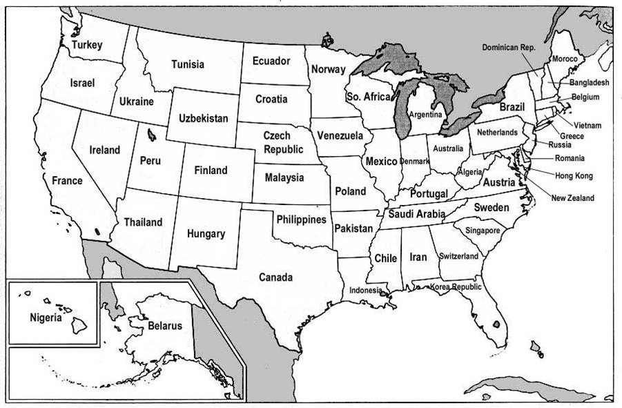

Les Etats Unis d'Amérique (USA) forment la plus grosse économie du monde, avec un Produit National Brut (PNB) de 13220 milliards de $.

[Cet article sur "strange maps"](http://bigthink.com/ideas/21182) présente une carte des USA dans laquelle chaque état est rebaptisé comme un pays ayant le PNB le plus proche de celui de l'Etat :

La carte ne tenant pas compte de la population, il ne faut pas l'interpréter en pensant qu'elle illustre le niveau de vie, mais bien uniquement la puissance économique des états. La domination des USA sur l'économie du continent américain est flagrante puisque le Texas fait autant de business que le Canada, et l'Illinois autant que le Mexique...

En définitive, lorsqu'on dit que "les USA sont la plus grande puissance économique du monde", c'est surtout du à leurs limites politiques, car si l'on considérait l'Union Européennen comme une entité économique, elle serait N°1 avec un PNB de 14500 milliards de $ (en 2006)
