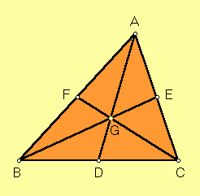
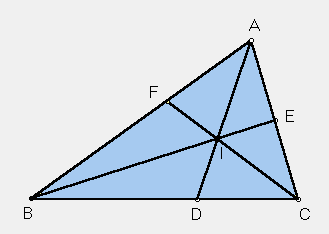
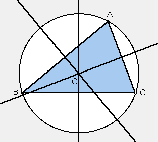
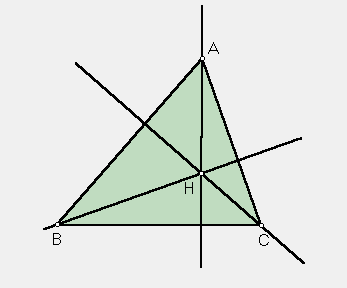
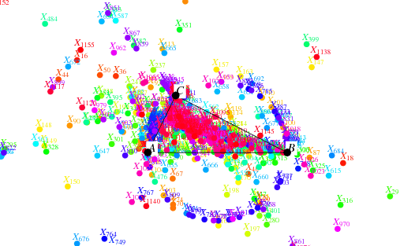

Combien de centres a un triangle ? J'en connaissais autant que les Grecs : 4 :

|     le centre de gravité, intersection des médianes   |     le centre du cercle inscrit, intersection des bissectrices   |
| --- | --- |
|  le centre du cercle circonscrit, intersection des médiatrices |  l'orthocentre, intersection des hauteurs |

Et voilà que les mathématiciens se sont récemment demandés ce que ces 4 points ont en commun et ont défini les propriétés que toutes les 4 "[fonctions centre de triangle](http://mathworld.wolfram.com/TriangleCenterFunction.html)" ci-dessus satisfont.

Mais alors, depuis 1994 un certain Klark Kimberling s'est mis à répertorier toutes les "fonctions centre de triangle" satisfaisant les propriétés dans son "[Encyclopedia of Triangle Centers](http://faculty.evansville.edu/ck6/encyclopedia/ETC.html)" qui en contient désormais plus de 3000!

 Quelques centaines de "[Centres de Kimberling](http://mathworld.wolfram.com/KimberlingCenter.html)"

Je doute que tous ces points trouvent un jour une utilité, mais j'aime bien la "pensée différente" des mathématiciens comme Kimberling : une fois qu'on a généralisé un savoir millénaire dans une petite formule, l'utiliser à l'envers pour découvrir un monde ignoré. Joli, non ?
