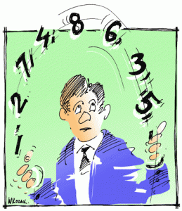

"[Trompeuses statistiques](http://www.pourlascience.fr/ewb_pages/f/fiche-article-trompeuses-statistiques-19392.php)" de Jean-Paul Delahaye est un excellent article paru dans le "Pour la Science" de juillet 2007 dans la rubrique "Logique et Calcul". Il est illustré par quelques magnifiques citations:

- Fêter les anniversaires est bon pour la santé : les statistiques montrent que les personnes qui en fêtent le plus deviennent les plus vieilles (Den Hartog)
- Les statistiques, c'est comme le bikini : ce qu'elles révèlent est suggestif et ce qu'elles cachent est essentiel. (Aaron Levenstein)
- Le loto, c'est un impôt sur les gens qui ne comprennent pas les statistiques. (anonyme, mais ça aurait pu être de moi...)
- A la question "faites vous encore confiance aux sondages ?", 64% des Français répondent Oui et 59% répondent Non (Philippe Geluck)
- J'en ajoute une de Steven : 30% des accidents de la route sont dus à l'alcool, mais 70% c'est quand on a rien bu ! Alors qu'est-ce qui est le plus dangereux ?

Plus sérieusement, l'article commence par montrer qu'on n'est pas très habiles à manipuler les pourcentages. Par exemple : si l'essence augmente de 25%, de combien doit-elle ensuite diminuer pour revenir à son prix initial ?

Le piège est qu'on a tendance à ajouter 25% au prix plutôt que de le multiplier par 1.25, donc à penser qu'il faut ensuite soustraire 25% alors qu'il faut le diviser par 1.25, soit multiplier par 0.8, donc réduire de 20%.

J.-P. Delahaye montre ensuite que certaines statistiques pouvant être interprétées dans des sens contradictoires résultent du "[paradoxe de Simpson](https://fr.wikipedia.org/wiki/paradoxe_de_Simpson)" ou "effet de Yule-Simpson", comme dans cet exemple:

Après une restructuration d'entreprise, le syndicat reproche une diminution des salaires de 10%, mais le patron rétorque que le salaire moyen a augmenté de 24%. Et les deux ont raison:

- en 2006, l'entreprise employait 1000 ouvriers à 1000€ / mois et 100 cadres à 2000€ / mois : salaire moyen 1090€
-  en 2007, elle n'emploie plus que 100 ouvriers à 900€ mais a gardé les 100 cadres, diminués à 1800€ : moyenne 1350€ !

D'autres exemples concernant notamment les sondages montrent qu'ils faut faire très attention en combinant des statistiques provenant d'effectifs différents, ou en choisissant les populations mesurées.

Le passage qui m'a le plus intéressé concerne l'[espérance de vie](https://fr.wikipedia.org/wiki/espérance_de_vie).  Comment calcule-t-on les [80.51 ans d'espérance de vie à la naissance des hommes en Suisse en 2006](http://www.indexmundi.com/fr/suisse/esperance_de_vie_a_la_naissance.html) ? Jusqu'ici, je pensais qu'on faisait la moyenne des âges des décès en 2006 et qu'on obtenait donc une mesure "retardée" d'environ 80 ans, corrigée en tenant compte de la tendance : le Suisse gagnant 1 an d'espérance de vie tous les 8 ans, on aurait pu ajouter environ 10 ans à l'âge moyen des gens décédés en 2006 pour obtenir l'espérance de vie à la naissance en 2006.

En fait, c'est calculé plus subtilement : on considère une population fictive née en 2006, qui aurait chaque année de leur vie future une probabilité de mourir correspondant à celle constatée en 2006 pour cette tranche d'âge. Autrement dit, on extrapole dans le futur la distribution actuelle des décès en fonction de l'âge. Ainsi, la mortalité infantile qui ne va que peu varier l'an prochain sera parfaitement prise en compte, alors que le destin des quelques personnes extrêmement âgées n'influence effectivement l'espérance de vie qu'avec plus d'un siècle de retard.
