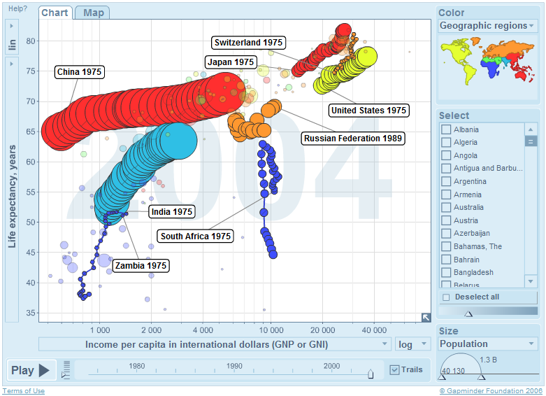

[Gapminder.org](http://www.gapminder.org/) est une fondation visant à mettre à disposition du public les statistiques sur le développement mondial sous une forme pratique. Le résultat est tellement génial qu'il est hébergé chez Google : [The Gapminder World](http://www.gapminder.org/world/).

Il permet de visualiser des corrélations entre les données statistiques des pays et d'animer leur évolution dans le temps. Dans l'exemple ci-dessous, chaque pays sous la forme d'un cercle de taille proportionnelle à la population, placé sur l'axe X au revenu moyen et sur l'axe Y à l'espérance de vie de ses habitants :

 [ _(cliquer pour agrandir)_](/wp-content/uploads/HLIC/93af218a1a08c29635aa94c3964bf964.png "gapminder.png")

On peut sélectionner certains pays pour les comparer et voir par exemple :

- des pays comme la Zambie sombrer alors qu'ils étaient dans une position comparable à l'Inde en 1995
- que l'espérance de vie en Inde a augmenté très rapidement, alors que le SIDA fait des ravages en Afrique du Sud
- la croissance économique spectaculaire de la Chine, qui a rattrapé la Russie, stagnante.
- la Suisse, un peu hésitante (ou un bon compromis?) entre le Japon et les USA.

[The Gapminder World](http://www.gapminder.org/world/) permet de créer ainsi de nombreuses autres représentations animées et parlantes de l'évolution du monde, apportant ainsi un progrès indéniable par rapport à des sites comme l'excellent [NationMaster](http://www.nationmaster.com/index.php), plus complet en termes de chiffres, mais plus statique aussi. Gapminder a été fondé par le professeur suédois Hans Rosling, qui avait constaté que ses étudiants souffraient de préjugés sur le Tier-Monde qui n'étaient plus d'actualité. Si vous comprenez l'anglais, il faut absolument voir sa [géniale présentation](http://www.ted.com/talks/hans_rosling_shows_the_best_stats_you_ve_ever_seen.html) à la conférence TED 2006 qui utilise [Gapminder World](http://www.gapminder.org/world/) pour montrer entre autres :

1. que la distinction nette entre "pays riches à faible natalité" et "pays pauvres à beaucoup d'enfants", réelle en 1975, s'est totalement diluée en 30 ans pour former un nuage continu
2. la progression spectaculaire de l'Asie : le Vietnam a aujourd'hui un revenu par habitant et une espérance de vie comparable aux USA de 1975 !
3. que les pays d'Afrique couvrent une échelle très vaste qui interdit de continuer à les "mettre dans le même sac"
4. que l'échelle des revenus des Chinois recouvre sensiblement celle des Etats-Uniens...
