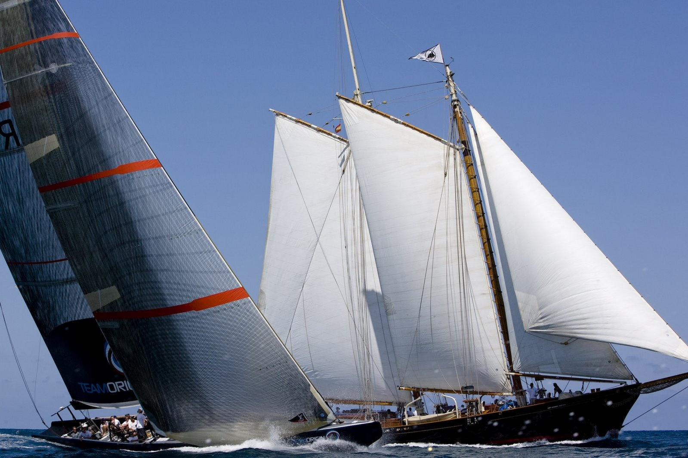

Une magnifique photo pour illustrer 156 ans d'évolution de la technologie maritime : la goélette ["America" qui donna son nom à la Coupe du même nom en 1851](http://drgoulu.local/) "régatant" avec Team Shosholoza, valeureux Challenger sud-africain en 2007.

Cette photo vient de [ce site](http://sailjuice.blogspot.com/2007/07/gbr-75-tunes-up-against-america.html), où l'on en trouve d'autres similaires
