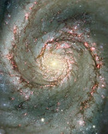

Dévoré l'excellent [Dossier de Pour la Science sur les Galaxies](http://www.pourlascience.fr/index.php?ids=MngULBvFQJGsCaPUOXfx&Menu=Dossier&Action=1&idn1=45). Les progrès de l'astrophysique dans la compréhension des Galaxies sur les 20 dernières années sont stupéfiants, et les conséquences sur la compréhension de la structure de l'Univers sont ... mesmérisantes ! (je cherchais un mot encore plus fort que "stupéfiantes", et en plus Google va aimer...)

En fait, l'étude des galaxies n'arrête pas de remettre en question nos certitudes:

1. Entre 1920 et 1930, Hubble confirme ce que le philosophe Emmanuel Kant avait postulé en 1755 déjà : de nombreuses "nébuleuses" observées sont en fait des "univers-îles" formées de milliards d'étoiles tout comme la "Voie Lactée" à laquelle nous appartenons. Comme à l'époque de Galilée, nous sommes remis à notre place : un endroit quelconque d'un Univers gigantesque.
2. Puis Hubble comprend la signification de ce que Vesto Slipher avait mesuré depuis 1910 : les galaxies s'éloignent de la notre d'autant plus vite qu'elles sont loin : l'Univers est en expansion, et donc a été à un certain moment extraordinairement dense avant de se dilater au cours du Big Bang. Einstein constate qu'il a fait "la plus grande erreur de sa vie" en fixant la valeur de la "constante cosmologique" qui apparaissait dans ses équations de façon à ce que l'univers soit obligé d'être en équilibre immuable. En fait c'est l'idée d'un Univers éternel, voire même d'un Univers créé qu'il n'a pas pu remettre en question.
3. Il y a quelques années, la grande question était d'expliquer la forme des galaxies, et en particulier les spirales. Normalement, les étoiles situées près du centre galactique devraient tourner autour de lui beaucoup plus vite que les étoiles de la périphérie, et les bras devraient s'enrouler en faisant beaucoup de tours au point de devenir invisibles. En fait, ce sont des "ondes de densité" d'étoiles qui provoquent la structure spirale. Comme je n'ai pas retrouvé sur internet les illustrations très claires de l'article, j'en ai refait une. Vous voyez les spirales ? Elles ne sont pas dessinées, mais provoquées par la proximité d'ellipses légèrement décalées les unes par rapport aux autres, et c'est justement le long de trajectoires de ce type que des milliards d'étoiles gravitent autour de leur Galaxie : les bras spiraux ne sont que des régions où il y a momentanément une plus grande densité d'étoiles.
4. Il y a tellement d'étoiles dans une Galaxie (1000 milliards dans la Voie Lactée !) et les distances entre elles sont telles qu'il vaut mieux considérer une galaxie comme du gaz où les étoiles seraient des atomes qui s'attireraient mutuellement, et raisonner en termes de densité comme ci-dessus plutôt que de s'intéresser à la position de chaque étoile. On s'est aperçu que les simulations effectuées en ordinateur ne correspondaient pas à la réalité car il manquait de la masse : les étoiles ne sont pas suffisantes pour constituer une Galaxie qui "tourne rond". La "masse manquante" a été partiellement découverte:
    1. Dans le trou noir central qui habite chaque Galaxie. Celui qui se tapis au centre de notre Voie Lactée [vient d'être découvert](/) : il pèse autant que 3'000'000 de Soleils, c'est donc un petit comparé à ceux trouvés dans d'autres galaxies, et un trou très noir et inactif comparé à ceux qui propulsent des milliards de tonnes de gaz par jour (ou par seconde?) à la vitesse de la lumière dans l'espace inter galactique
    2. Dans le gaz. Entre les étoiles d'une Galaxie, on trouve une dizaine d'atomes d'hydrogène par mètre cube d'espace. Presque rien. Mais "presque" multiplié par un volume titanesque de vide, ça fait des millions de masses solaires d'hydrogène et autres gaz qui remplissent la Galaxie. Expulsé par les étoiles mourantes, ce gaz s'agglomère en nébuleuses comme [Nebula Carina dont j'ai déjà parlé,](/) où il donne naissance à de nouvelles étoiles (voir plus bas)
    3. Dans la [matière sombre](http://fr.wikipedia.org/wiki/Mati%C3%A8re_sombre). D'une nature mystérieuse, elle a pratiquement été "inventée" pour correspondre aux observations astronomiques. Elle devrait former un halo autour des galaxies, mais n'interagit avec rien autrement que par gravité... Découvrir ce qui se cache derrière cette notion est l'un des grands challenge de la physique du XXIème siècle.
5. Petit calcul : 1'000 milliards d'étoiles qui brillent pendant environ 3 milliards d'années en moyenne (le Soleil brille depuis 5'000'000'000 d'années et en a encore 5'000'000'000 à vivre parce que c'est une petite étoile, mais les grosses étoiles crament en moins d'un milliard d'années), ça fait qu'en moyenne **une étoile s'éteint chaque jour** dans notre Galaxie ! Puisque quelques étoiles fossiles rougeoient depuis 12 milliards d'années, les autres auraient du s'éteindre depuis longtemps. Conclusion : les Galaxies agissent comme des recycleuses d'étoiles, et la Voie Lactée allume environ **une nouvelle étoile par jour aussi** ! incroyable, non ?
6. Une Galaxie est donc à une bulle de gaz qui se condense en un brouillard vaporeux d'étoiles, orbitant autour d'un trou noir minuscule mais horriblement lourd, le tout baigné dans un halo sombre et mystérieux. Tout ça serait encore assez passif et peu intéressant s'il n'y avait pas des collisions de Galaxies ! Tous les quelques milliards d'années, la Voie Lactée avale des étoiles d'une Galaxie naine passant par là, tout en créant de terribles ondes de choc dans le gaz intergalactique (au lieu de 10 atomes par m3, il y en a soudain 20 !), ce qui suffit à créer des étoiles par millions et à rajeunir les deux galaxies, qui finissent par fusionner parfois. Voici à quoi va ressembler la rencontre de la Voie Lactée avec la Galaxie d'Andromède dans 2 milliards d'années: \[youtube dJRc37D2ZZY\] Rappelez-vous que les petits nuages bleus sont constitués de millions d'étoiles...
7. Si les collisions de Galaxies ne sont pas rares, c'est qu'elles sont regroupées en amas, eux mêmes regroupés en superamas gigantesques qui semblent s'être formés le long de filaments ou la matière s'est concentrée juste après le Big Bang.

L'Univers est non seulement incroyablement gigantesque, mais l'image selon laquelle il se dilue dans le néant en se refroidissant irrévocablement depuis le Big Bang est pessimiste. Il y l'air doté de mécanismes capables de produire pratiquement sans fin du neuf à coups de cataclysmes titanesques ou de subtils échanges s'étalant sur des milliards d'années.

A croire que la Création est loin d'être finie...
