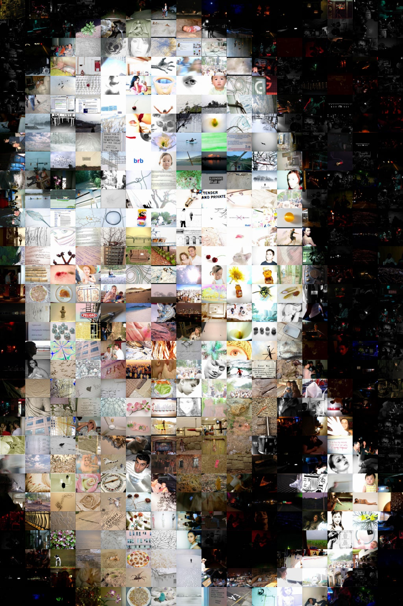
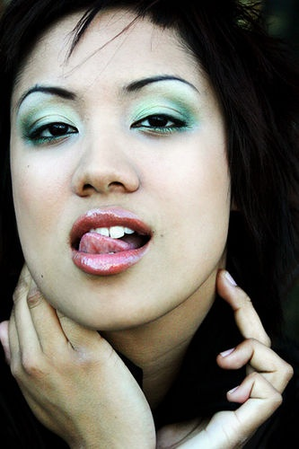

Exemple de découverte surprenante au cours d'un surf internet:

A la base, je cherchais un logiciel permettant de visualiser un très grand graphe au format SVG, généré par [GraphViz.](/) J'ai trouvé [ZGRViewer](http://zvtm.sourceforge.net/zgrviewer.html), qui est très bien, mais un peu lourd à mettre en oeuvre sur un site web.

Alors je me suis demandé s'il existait quelque chose permettant de visualiser de grandes images, puisque mon graphe peut aussi tenir sur un format de 10'000 x 40'000 pixels... J'ai trouvé [Vliv (Very Large Image Viewer)](http://delhoume.frederic.free.fr/vliv.htm), un programme pour Windows qui arrive à afficher des images de 100'000 x 100'000 pixels ! Sur le site on trouve des exemples d'images gigantesques a télécharger:

- un collage d'[images à haute résolution de la Terre](http://visibleearth.nasa.gov/view_set.php?categoryID=2363), réunies en une seule qui fait plus de 11 Gigabytes !
- les [magnifiques images du téléscope spatial Hubble](http://www.spacetelescope.org/images/)
- les images du projet [Gigapxl](http://www.gigapxl.org/gallery.htm), qui a développé un appareil photo pour l'astronomie offrant une résolution de plus d'un giga-pixel, soit 100x plus que les appareils photo du commerce. L'équipe de Gigapxl réalise des photos spectaculaires de monuments (artificiels et naturels) des USA
- des [Photomosaïques](http://www.photomosaic.com/).

La Photomosaïque consiste à faire un collage de petites photos qui ressemble le plus possible à une grande photo au départ. Par exemple, la photo "Kim Mosaic" ci dessus a été réalisée avec le logiciel [Metapixel](http://www.complang.tuwien.ac.at/schani/metapixel/) (pour Linux uniquement :-( ) développé par Shani, l'auteur de la photo, à partir de la [photo de droite](http://www.flickr.com/photos/jshumate/1554554/) et d'une multitude d'autres photos qu'il avait en stock, le logiciel réalisant le collage en choisissant parmi les petites images celles qui correspond le mieux à la zone qu'elle couvre sur la grande.

Génial non ?
