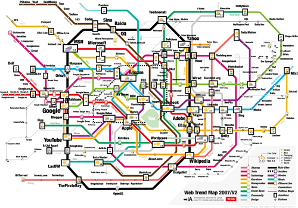

Trouvé cette "carte du Web pensée différemment“ représentant les sites les plus importants connectés par des lignes de métro représentant leurs fonctions:

 [ _(cliquez pour ouvrir un plan interactif)_](http://www.informationarchitects.jp/en/)

Des images de différents formats et même un screensaver pour Mac peuvent être obtenus sur [cette page](http://www.informationarchitects.jp/en/ia-trendmap-2007v2/), qui comporte beaucoup d'informations (en anglais) sur cette carte très bien faite.
