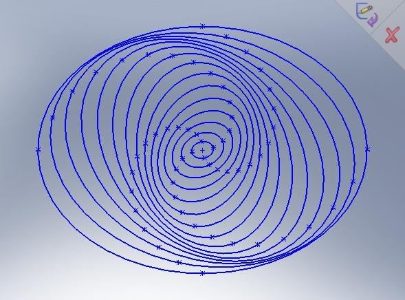

Poursuivant ma découverte (\*) du génial Hyperion 3D, je me suis attaqué à simuler une Galaxie Spirale.

Il faut dire que la formation des bras spiraux des galaxies n’a été comprise que récemment parce qu’il fallait « penser différemment ». Bien que je l’aie un peu expliqué [ici](/2007/07/23/galaxies/), je voulais le voir pour le croire. Et voilà, c’est fait, admirez !



Si vous voulez vous aussi explorer de belles galaxies virtuelles en temps réel, il vous faut:

1. [télécharger Hyperion ici](http://www.ozone3d.net/hyperion.php) et l’installer
2. télécharger [Hyperion\_Galaxy Demo\_Src.zip](http://www.ozone3d.net/downloads.php?fid=2051 "spiralgalaxy-demo.zip") , et le décompresser n’importe où
3. lancer Hyperion et ouvrir SpiralGalaxy.xml .
4. Jouer avec les touches F1-F2 et F3-F4 qui modifient les paramètres eratio et etwist (voir plus bas) pour obtenir différentes spirales.

Comme le montre l’image ci-contre (réalisée avec une petite macro SolidWorks, en passant…) les bras spiraux sont simplement un effet géométrique : ils correspondent à la zone dans laquelle les ellipses sont rapprochées, donc il y a une plus grande densité d’étoiles dans ces zones, mais les étoiles suivent tout de même des orbites elliptiques : elles ne restent pas dans les bras.

La simulation fait décrire à quelques milliers d’étoile des trajectoires elliptiques autour du centre de la galaxie, le grand et le petit axe de chaque trajectoire étant tournés d’un angle qui dépend de la distance moyenne au centre. Il faut donc calculer la trajectoire de chacune des milliers d’étoiles en temps réel, chose possible avec Hyperion grâce à son intégration du langage LUA, que je ne connaissais pas du tout. C’était donc l’occasion de l’apprendre. Il a beaucoup de qualités dont je reparlerai ailleurs, et un gros défaut : faiblement typé, il n’effectue que peu de vérifications à la compilation et aucune à l’exécution : en cas d’erreur, c’est le crash.

La programmation ne pose aucune difficulté particulière pour quelqu’un connaissant un peu la trigo et la 2D. Oui, 2D parce que tous les calculs se font dans le plan XY, la coordonnée Z de chaque étoile étant un petit nombre aléatoire constant, destiné à donner un peu d’épaisseur à la Galaxie.

La visibilité des bras dépend:

1. de deux paramètres définissant:
    1. l’aplatissement des ellipses (eratio = grand axe / petit axe)
    2. l’angle de rotation des ellipses en fonction du rayon (etwist)
2. de l’apparence des étoiles. Les premiers bras bien visibles ont été obtenus avec des étoiles texturées avec un gros point rouge. En utilisant une texture d’étoile réaliste trouvée [sur cette page,](http://www.celestiamotherlode.net/catalog/extrasolar_stars.php) la couleur est plus crédible, mais les bras sont moins visibles :

l’idéal serait d’utiliser plusieurs vertex pool avec plusieurs textures différentes pour simuler différents types d’étoiles, avec leurs couleurs.

_(article aussi publié [sur 3DMon.com](http://3dmon.wordpress.com/2007/08/26/simulation-de-galaxie-spirale/) )_
