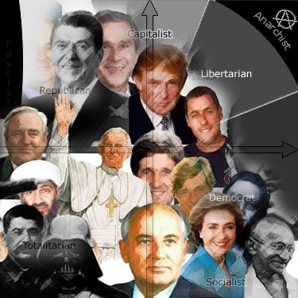
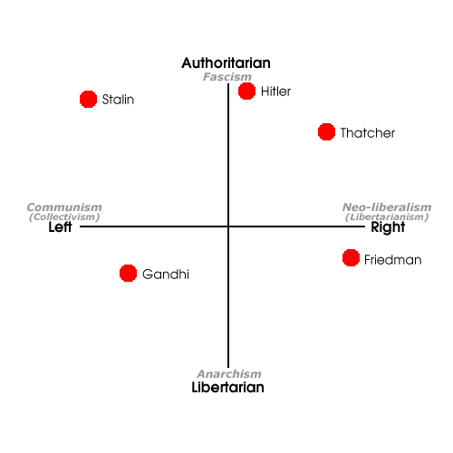
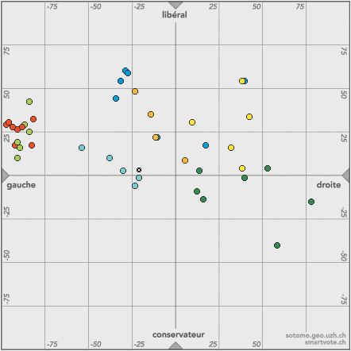

De plus en plus de tests en ligne permettent de se situer sur l' "échiquier politique", voire de trouver les candidats à une élection dont les idées sont les plus proches des siennes, comme [smartvote.ch](http://www.smartvote.ch) pour les prochaines élections fédérales Suisses.

Le mot important pour "[penser différemment](/2009/03/06/pourquoi-comment-combien/)" c'est "échiquier" : ces outils représentent dorénavant la position des forces politiques sur un plan avec 2 axes X et Y, et plus vraiment dans la représentation traditionnelle linéaire droite/gauche.

<!--more-->

|   - [Le test politique d' okcupid](http://www.okcupid.com/politics) dont j'avais déjà parlé [ici](/2007/01/16/test-politique/) distingue :     - X : la permissivité sociale     - Y : la permissivité économiquela vision américaine de ce plan est représentée ci-contre : grosso-modo la gauche traditionnelle est en bas à droite et la droite est en haut à gauche ...   |
| --- |
|   - sur [politicalcompass.org](http://www.politicalcompass.org/test),     - l'axe gauche/droite est conservé en X     - l'axe Y va de "libertaire" en bas à "autoritaire" en haut   |
|  |
|   - Sur [smartvote.ch](http://www.smartvote.ch/analysis_v/smartmap.php)les 2 axes sont:     - X : gauche / droite     - Y : conservateur en bas, libéral en hautVoici le positionnement des candidats aux élections fédérales de cet automne à Genève selon smartvote :     PRD  PSS  PDC  UDC  Les Verts  PLS  PEV  JSG  MOI |

Quelques remarques:

1. l'UDC se positionne sur la droite, mais surtout sur le bas, peu disputé...
2. les libéraux sont plus de droite que libéraux, alors que certains radicaux genevois débordent le PDC à gauche...
3. les verts+roses forment un groupe bien compact à gauche, mais d'une surface limitée et avec une superposition quasi totale ...

Ce qui me parait le plus intéressant, c'est la méthode permettant de trouver les candidats les plus proches de nos propres opinions. Smartvote offre deux approches distinctes :

1. lister les candidats ayant le plus de réponses identiques aux siennes (miennes, votres),
2. indiquer les candidats dont la position est la plus proche sur la carte.

Le problème [remarqué intuitivement par Bretzelman](http://www.nack.ch/2007/08/19/berk-ca-donne-pas-envie/) est que les 2 méthodes ne correspondent pas forcément : on peut être proche sur l'échiquier de quelqu'un dont les réponses le placent là alors qu'il a répondu très différemment aux questions ! Dans mon cas par exemple :

- les candidats ayant le plus de réponses communes avec les miennes sont [les Verts](http://www.verts.ch/GE/), mais aucun socialiste ne m'a été "recommandé" alors que Verts et PS se superposent sur la carte 2D
- sur la carte, je suis pourtant beaucoup plus proche des partis "du centre" (PRD+PDC) que des Verts, mais tiens, je serais plus conservateur, ce qui me place proche des "PEV". Je ne sais même pas qui c'est... Je cherche... c'est le [Parti Evangélique](http://www.pev-ge.ch/)! Je les respecte beaucoup, mais je pense avoir très peu de réponses communes avec eux.

Comme j'ai tenté de le décrire dans un commentaire [ici,](http://signature.rsr.ch/?p=327) la politique doit effectivement s'adapter à l'ère du zapping
