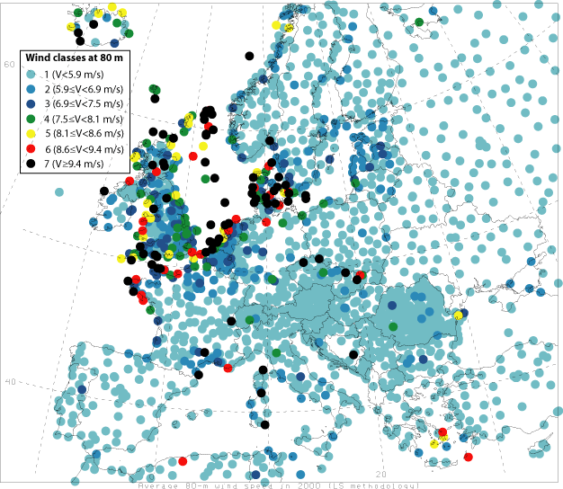

L'émission "Temps Présent" de cette semaine sur la société à 2000 W présente un léger progrès par rapport à la situation décrite dans [Les énergies renouvelables en Suisse](http://drgoulu.local/2005/01/25/les-energies-renouvelables-en-suisse) : le solaire et l'éolien sont désormais présentés comme de "nouvelles énergies renouvelables" alors que l'hydraulique, qui fournit 60% de l'électricité en Suisse, est une vieille énergie renouvelable, mais qui ne vaut toujours pas la peine qu'on en parle.

Et j'apprends avec stupéfaction que le Parlement Suisse a voté une loi obligeant les distributeurs d'électricité à acheter l'énergie solaire et éolienne produite en Suisse "à prix coûtant", alors que l'énergie hydraulique est soumise à 100% aux lois du marché !

Avec ce genre de conséquences par exemple :

- le fermier qui couvre un pan de sa grange de panneaux solaires produit pendant la journée plus d'énergie qu'il n'en consomme : il la vend au prix coûtant, soit [autour de 1 Frs le kWh (!!!)](http://www.lausanne.ch/view.asp?docId=21605&domId=63624&language=F) elle est revendue instantanément 25 cts/kWh sur le réseau. Le soir pour sa télé, il rachète de l'électricité nucléaire+hydraulique, voire éolienne s'il souffle. J'espère seulement qu'il est obligé de la payer 1 Frs aussi, et pas 25 cts ...
- la nuit, lorsque nos barrages achètent le surplus d'énergie nucléaire autour de 4 cts/kWh, ils devront aussi acheter à plus de 20 cts/kWh celle des éoliennes qui tournent, pour la revendre ensuite autour de 10 cts/kWh en moyenne, donc à perte alors qu'ils ont fourni le service de la stocker proprement !

Tout comme le plan Wahlen avait fait planter des patates à 1500m d'altitude dont il ne reste plus trace, le "[Plan Wahlen de l'énergie](http://www.verts.ch/web/gruene/fr/positions/environnement/energie/politique_energetique/resolutions/schweizer_energiepolitik_gruene_fordern_plan_wahlen_29-08-6.html)" réclamé par les Verts consiste à planter des éoliennes dans un pays connu pour être mal venté:

Le problème n'est pas qu'elles ne tourneront pas, mais qu'elles produiront de l'énergie plus chère que les éoliennes hollandaises ou normandes, et plus chère que les barrages suisses, donc d'une manière économiquement non viable sur le long terme.

Le problème n'est pas très différent pour le solaire :



le solaire marche, mais 60% moins bien sur le Plateau qu'en Provence.

Si un privé motivé veut monter des panneaux solaires sur sa maison, pourquoi pas, mais est-ce bien raisonnable subventionner "à prix coutant" à l'échelle du pays des productions dont on sait qu'elles ne pourront pas être compétitives ? La Suisse doit investir massivement dans l'énergie renouvelable pour laquelle elle dispose d'avantage compétitifs majeurs : l'hydraulique.

En cherchant des infos, je suis tombé sur ces excellentes pages:

- [sur la production, le marché et l'échange d'électricité en Suisse](http://www.installations-electriques.net/Instal/production.htm)
- et [sur les tarifs](http://www.electricitepourdemain.ch/contents/prix-electricite)
