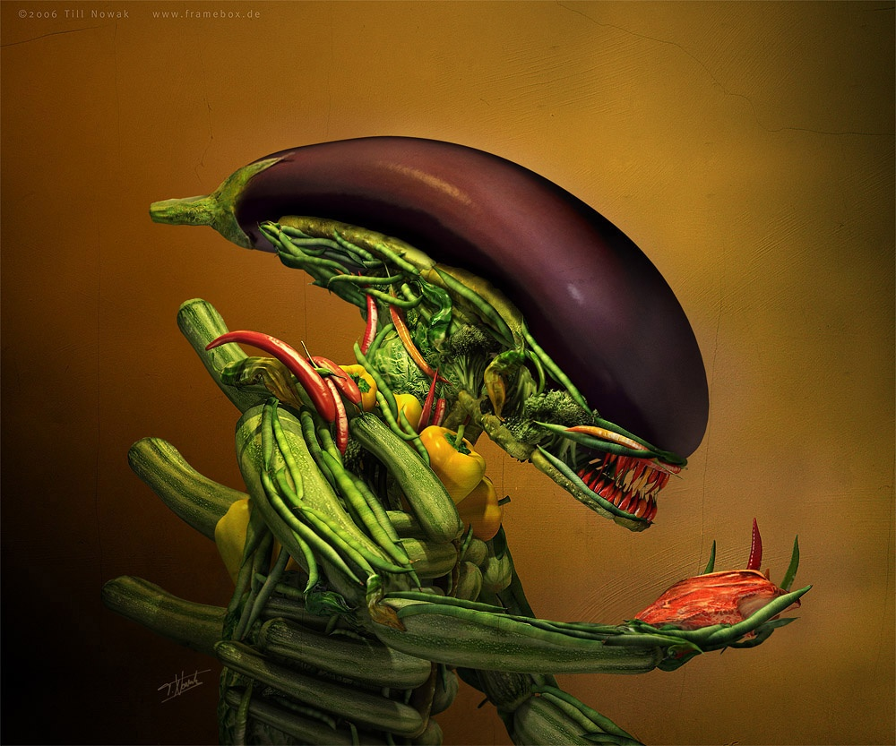

Till Nowak est le graphiste allemand qui a commis ceci :

Les gens cultivés reconnaitront dans cette oeuvre baptisée "[Salad](http://www.framebox.de/creations/3d/salad/)" le génial "Alien" de Giger traité à la manière d'Arcimboldo. Till Nowak a entièrement modélisé l'Alien en 3D avant de le recomposer à l'aide de légumes modélisés eux aussi en 3D. Tout le travail est décrit dans [ce document pdf](http://www.framebox.de/creations/3d/salad/makingof_salad_web2.pdf)
