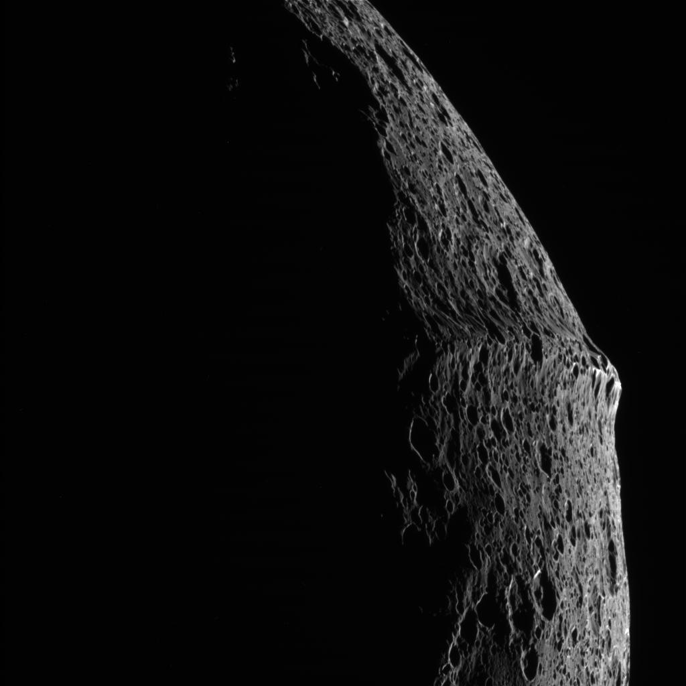

La sonde Cassini qui explore les environs de Saturne vient de passer très près de Japet, une petite lune de 1436 km de diamètre seulement [découverte par l'astronome Cassini en 1671.](w:Japet_(lune)) Cassini (la sonde) vient d'y découvrir une particularité unique dans le Système Solaire : un bourrelet de près de 20km de haut suit parfaitement l'équateur de Japet sur tout son pourtour, lui donnant une allure de noix spatiale.

Il ne reste plus qu'à expliquer la formation de cette crête. Deux théories sont déjà en course :

- la rotation de Japet aurait brutalement ralenti lors de sa formation,
- ce serait les vestiges d'un anneau entourant Japet lors de sa formation et qui serait tombé sur l'astre

### Sources :

- [Splendides gros plans de la lune Japet de Saturne par Cassini](http://www.techno-science.net/?onglet=news&news=4518) sur Techno-Science
- [Japet, une coquille de noix autour de Saturne](http://www.techno-science.net/?onglet=news&news=3135) sur Techno-Science

### Voir aussi :

- sur "[les meilleures photos d'astronomie de 2006](/)", l'incroyable photo de Saturne prise par Cassini où l'on voit la Terre à travers les anneaux
