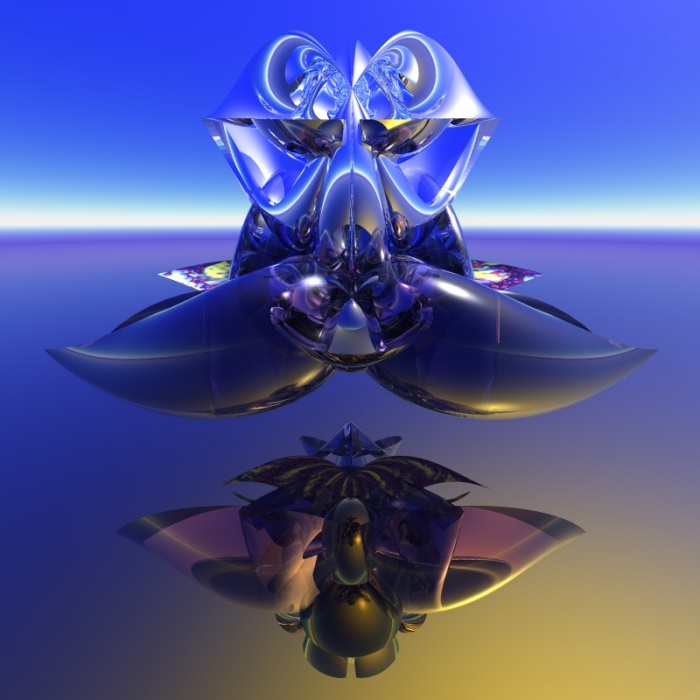
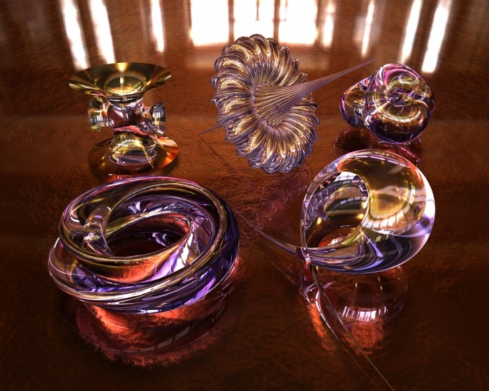
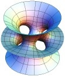
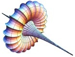
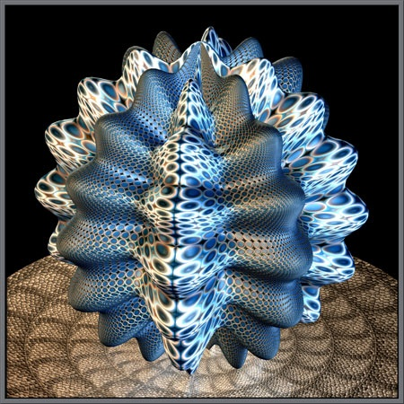

Les maths, ça peut être très beau. Si si. Il y a même des artistes qui utilisent des logiciels de calcul d'objets géométriques pour réaliser des oeuvres étonnantes comme celle-ci par exemple:

 [ _Supershape Combo 5_](http://www.renderosity.com/mod/gallery/index.php?image_id=852417&member) _de [Luc Benard](http://www.renderosity.com/mod/gallery/browse.php?user_id=119539)_

 Cette image est une combinaison de surfaces calculées avec la géniale formule mathématique des "[supershapes 3D](http://paulbourke.net/miscellaneous/supershape3d/)" dont je reparlerai très bientôt, puisque mon projet projet "[Supershape Exporer : a first experience with DevLib](/)" commencé en 2004 a repris avec [Hyperion.](/)

En admirant les autres oeuvres de [Luc Benard](http://www.renderosity.com/mod/gallery/browse.php?user_id=119539), je suis tombé  sur celle-ci, montrant d'autres objets mathématiques intéressants :

 Ces objets ont été calculés avec le logiciel [3D-XplorMath](http://3d-xplormath.org/) avant d'êtres "mis en scène" et rendus avec un autre logiciel (Alias Wavefront). 3D-XplorMath est un programme gratuit, permettant de calculer beaucoup de surfaces intéressantes du point de vue artistique, regroupées dans un [Virtual Math Museum](http://virtualmathmuseum.org) avec par exemple:

- des surfaces minimum, correspondant à la surface "choisie" par une pellicule de savon pour s'accrocher à une armature de fil de fer donnée, ce qui donne par exemple la surface  de [Costa-Hoffman-Meeks](http://virtualmathmuseum.org/Surface/costa-h-m/costa-h-m.html) ci-contre:
- des surfaces "sphériques" et "pseudosphériques" obtenues en déformant des sphères, comme la très belle surface de [Breather](http://virtualmathmuseum.org/Surface/breather_p/breather_p.html) que l'on reconnait dans l'oeuvre de Luc Benard.

le [Virtual Math Museum](http://virtualmathmuseum.org) propose également une [liste d'artistes](http://virtualmathmuseum.org/mathart/MathematicalArt.html) comme :

- [Bathsheba](http://www.bathsheba.com/) Grossman , qui crée et vend des sculptures d'objets mathématiques, dont les [modèles 3D de certains sont disponibles ici!](http://www.bathsheba.com/downloads/) Il fait aussi de magnifiques [modèles de molécules en verre](http://crystalprotein.com/)
- Brian Johnston, qui considère les maths comme un prolongement de son microscope dans [cet article extraordinaire](http://www.microscopy-uk.org.uk/mag/artjan06/bjmaths.html) où il  décrit en détail le moyen de produire des images comme celle-ci : 
- [Paul Nylander](http://bugman123.com/), dont le site hyper surchargé et illisible cache des centaines de merveilles, à tel point que j'ai envie de lui en créer un nouveau rien que pour lui ...

