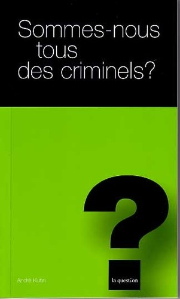

 A la radio ce matin j'ai entendu [André Kuhn](https://applicationspub.unil.ch/interpub/noauth/php/Un/UnPers.php?PerNum=801466), prof. de criminologie à l'UNIL, donner une petite leçon de "pensée différente" à propos des statistiques de la criminalité en Suisse.

En gros il disait que oui, les étrangers commettent proportionnellement plus de crimes que les citoyens suisses, mais que non, le fait d'être étranger n'était pas "statistiquement significatif".

Ceci tient au fait que les jeunes hommes de milieu social défavorisé sont sur-représentés dans la population immigrée par rapport aux citoyens suisses, et que si l'on compare la criminalité des étrangers à un échantillon de la population suisse composée de la même proportion de jeunes hommes de milieu social défavorisé, il n'y a pas d'écart "statistiquement significatif" dans la criminalité de ces deux populations.

Donc ce n'est pas le fait d'être étranger qui compte, mais celui d'être issu d'un milieu défavorisé. D'après le Prof. Kuhn, ceci est d'ailleurs un fait constaté dans de nombreux autres pays hébergant une population immigrée.

Ca me rappelle une petite étude sur les USA que j'avais fait sur un thème similaire : selon les [statistiques américaines](http://bjs.ojp.usdoj.gov/) les noirs représentent 12.5% de la population, mais sont les auteurs de 50% des crimes. Les Noirs sont donc environ 8x plus criminels que les Blancs. Oui, mais les Blancs qui sont pris dans la même (basse) tranche de revenu que les Noirs sont tout autant criminels, donc c'est le fait d'être pauvre qui génère de la criminalité (et/ou l'inverse, dans un cercle vicieux) et pas la couleur de peau.

### Plus d'infos :

- [rapport final (pdf, 500 kb)](http://www.ejpd.admin.ch/content/dam/data/kriminalitaet/jugendgewalt/ber-auslaenderkriminalitaet-agak-f.pdf "bericht_auslaenderkriminalitaet_f.pdf") du Groupe de travail "Criminalité des étrangers" (AGAK) de la Conférence des chefs de départements cantonaux de justice et police (CCDJP), 5 mars 2001
- \[openbook booknumber="ISBN:978-2-940063-66-6" templatenumber="5"\] , très bon bouquin [résumé ici](http://www.la-zone.ch/wp-content/uploads/Criminologie-r%C3%A9sum%C3%A9-de-Sommes-nous-tous-des-criminels.pdf) et en [vente pour Frs 10.- ici](http://www.lhebe.ch/description.php?SID=6e6e52b846150f1ff0ffcff2e5f13854)
