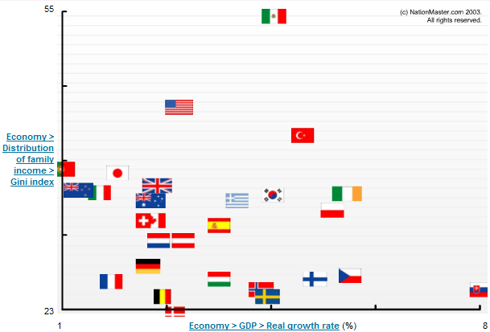
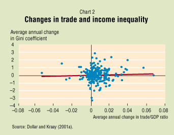

Dans "[Le Temps](http://www.letemps.ch/)" d'aujourd'hui, un article intitulé "**L’augmentation des inégalités a un effet différencié sur la croissance des régions**" de Dirk Schumacher commence par : "_Les inégalités de revenu au sein des grands pays industrialisés augmentent depuis quelques temps_ ». Or lorsque je m'étais intéressé à [vérifer cette assertion récurrente](/2007/01/09/les-inegalites-saccroissent-vraiment/), je n’avais trouvé de données appuyant cette assertion que pour les USA. D’après les autres sources que j’avais trouvé, les écarts de revenu diminuent en Suisse, et l’indice de Gini diminue aussi au niveau mondial.

Mais le titre de l'article affirme quelque chose de plus : l'augmentation des inégalités aurait un effet sur la croissance ! Cependant, et j'aurais tendance à dire heureusement, l'article ne démontre pas cette relation de cause à effet.

D'une part, le texte de l’article est criblé de conditionnels et de formules de précaution allant jusqu’à admettre que "_les chiffres ne permettent pas de conclure_". Sans la remettre en question, Schumacher suppute que la relation entre inégalités et croissance doit être plus compliquée et dépendre notamment de cycles conjoncturels, ce qui lui permet d'achever sur un catalogue de recommandations bien pensantes aux politiques, tout ceci basé en définitive sur une relation hypothétique entre un fait non avéré et la sacro-sainte croissance...

D'autre part, l'article est illustré par un graphique ressemblant à celui-ci, que j'ai obtenu grâce à [NationMaster :](http://www.nationmaster.com/plot/eco_gdp_rea_gro_rat-economy-gdp-real-growth-rate/eco_dis_of_fam_inc_gin_ind-distribution-family-income-gini-index/flag&id=OECD#details)

La figure est censée montrer une relation entre le taux de croissance (horizontalement) et l'indice de Gini, qui traduit les inégalités de revenu, comme [déjà expliqué ici](/2007/01/09/les-inegalites-saccroissent-vraiment/). Si les pays était disséminés le long d'une ligne bien nette, une relation serait défendable, mais ici, ce n'est pas clair du tout.

En plus et principalement, un tel graphique montrerait une corrélation qui ne suffit pas pour déduire une **relation de cause à effet** : est ce l'inégalité qui cause la croissance, ou la croissance qui cause l'inégalité ?

Pour le savoir, il faudrait examiner la relation entre la **variation** de l'inégalité et la **variation** de la croissance, en tenant éventuellement compte d'un décalage dans le temps, pour savoir si le fait de favoriser politiquement une inégalité des revenus crée génère une augmentation de la croissance.

A ce sujet, j'ai découvert cet article : David Dollar and Aart Kraay, "[Trade, Growth, and Poverty](http://www.imf.org/external/pubs/ft/fandd/2001/09/dollar.htm)", September 2001, Finance & Development (une publication du FMI) illustré par ce graphique, qui montre l'absence totale de relation entre la variation de l'indice de Gini et la variation de la part du commerce au PNB :

Ce graphique et le texte de l'article, de même que la faiblesse de l'argumentation de Schumacher "m'autorise à penser", comme dirait Coluche, que jusqu'à preuve du contraire, l'augmentation des inégalités n'est pas un fait globalement avéré et surtout pas un facteur de la croissance économique.
