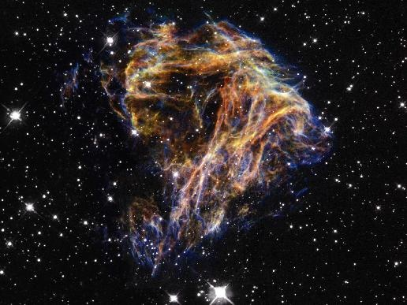

Mon nouveau fond d'écran est cette superbe image de la [NASA : "Celestial Fireworks":](http://www.nasa.gov/multimedia/imagegallery/image_feature_923.html)

Il s'agit des restes d'une étoile qui a explosé en supernova, ajoutant un point dans le ciel de nos ancêtres alors qu'ils taillaient des silex. Comme on le voit, les gaz expulsés par l'étoile ont perdu la [jolie symétrie qu'ils devaient avoir](/2007/03/08/perles-cosmiques/) juste après la méga-pétée, et ont commencé à se contracter en filaments, et en zones plus denses qui vont devenir de jeunes étoiles lorsque les dauphins tailleront des silex.

Au centre de l'image, en noir sur fond noir se trouve le [magnetar](w:Magnétar) résidu de l'étoile défunte . C'est un petite sphère de neutrons lourde comme plusieurs fois le Soleil et tournant sur elle-même en 8 secondes, donc assez lentement pour un pulsar. Cet astre est doté d'un champ magnétique si fort que si le Soleil avait le même, votre disque dur serait effacé instantanément, et si la Lune avait ce champ, votre fourchette décollerait de votre assiette pour percuter la Mer de la Tranquilité à la vitesse de la lumière !

Dieu a du [lécher un crapaud](/2007/09/28/il-faut-sabstenir-de-faire-le-moindre-lechage-de-crapaud/) juste avant de créer les supernovas ...
