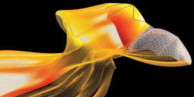
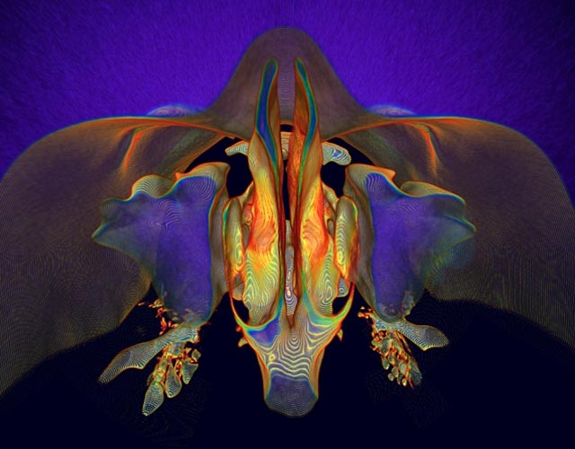

le journal [Science Magazine](http://www.sciencemag.org/) et la [National Science Fundation](http://www.nsf.gov/news/special_reports/scivis/index.jsp?id=win2007) états-unienne organisent chaque année un concours d'illustrations scientifiques. [Les gagnants de l'édition 2007](http://www.sciencemag.org/content/317/5846/1858.full) sont :

Vous voyez ce que c'est ? [Cliquez sur l'image](http://www.sciencemag.org/content/317/5846/1858/F4.expansion) pour voir le poster gagnant en entier C'est une simulation de l'écoulement d'air lors du vol de la chauve souris !

Il y a aussi cette photo étonnante :

Un insecte ? un microscopique animal marin ? En fait il s'agit d'une représentation 3D des fosses nasales et des sinus d'une chinoise aussi humaine que vous et moi, "vue de dessus". Son nez est en haut de la photo.

Mais la [préférée du blog infosthetics](http://infosthetics.com/archives/2007/09/nsf_science_informational_graphics_visualization_challenge_winners.html) que je suis de près est une video disponible sur YouTube qui explique le fonctionnement d'un cyclone, et plus particulièrement des "tours chaudes" :


