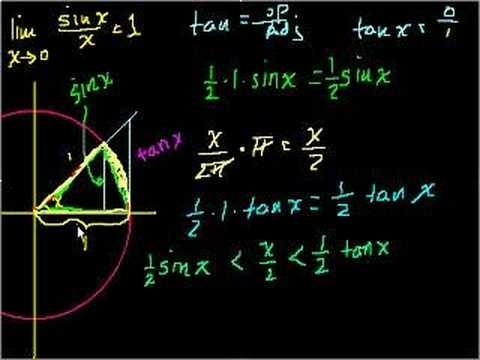

["The Right Way to Calculate Stuff"](http://www.plunk.org/~hatch/rightway.php) est une page pour informaticiens dans mon genre : elle contient des petits "snippets" de code utile pour contourner certains pièges tendus par les maths et la géométrie.

Par exemple, si on veut calculer sin(x)/x, il faut faire attention à ce qui se passe pour x=0, sinon on obtiendra une erreur de "division by zero" au lieu du résultat attendu, qui est 1. Un bon programmeur prévoira le coup en écrivant (en C++) :

\[sourcecode lang="cpp"\]if (x == 0.) return 1. else return sin(x)/x;\[/sourcecode\]

mais ce n'est peut-être pas suffisant. Si x est très petit, la division de deux nombres très petits approximés par nos chers ordinateurs a des chances d'être assez fausse. Pour des raisons expliquées en détail sur la page, il faut s'assurer en fait que x2 est encore un nombre numériquement assez grand par rapport à 1, donc un très bon programmeur écrira ceci :

\[sourcecode lang="cpp"\]if (1. + x\*x == 1.) return 1. else return sin(x)/x;\[/sourcecode\]

ce qui parait mathématiquement absurde puisqu'on imagine pas que 1+x2 puisse valoir 1 pour x≠0. Mais informatiquement, c'est très possible.

L'article donne ainsi une série de recettes pour calculer des expressions dangereuses, par exemple :

- 1-cos(x) → 2\*sin(x/2)2
- acos(1-x) → 2\*asin(sqrt(x/2))
- et bien d'autres

Mais les recettes les plus intéressantes (en tout cas pour moi) concernent la géométrie.

Pour calculer l'angle entre 2 vecteurs u et v, l' "approche pachyderme" comme disait Burgi consiste à évaluer acos(dot(u,v)), dot étant la fonction renvoyant le produit scalaire des 2 vecteurs. mais si u ou v ne sont pas parfaitement normalisés et que dot renvoie un résultat un pouillème plus grand que 1 : crash.

une deuxième approche est: 2\*atan2(abs(u-v),abs(u+v)). Pas mal mais couteux en temps de calcul. La meilleure implémentation est

\[sourcecode lang="cpp"\]if (dot(u,v) < 0.) return M\_PI - 2\*asin(abs(-v-u)/2) else return 2\*asin(abs(v,u)/2);\[/sourcecode\]

La partie vraiment intéressante concerne l'[interpolation sphérique linéaire](http://3dmon.wordpress.com/2007/10/11/linterpolation-spherique-lineaire/). (_Comme c'est assez spécifique à la 3D, je publie aussi ce qui suit [sur mon blog 3Dmon](http://3dmon.wordpress.com/2007/10/11/linterpolation-spherique-lineaire/)_ )

L'orientation d'un corps dans l'espace à 3 dimension est défini par 3 angles tout comme la position d'un objet posé sur une sphère est définie par les 2 angles de latitude et de longitude, plus un angle définissant l'orientation de l'objet

Le problème consistant à faire tourner "en douceur" un objet dans l'espace pour l'amener dans une orientation déterminée est appelé "interpolation sphérique linéaire" parce qu'il est équivalent à celui consistant à se déplacer "en douceur" sur une sphère pour atteindre une position et une orientation donnée. Le problème n'est pas trivial pour 2 raisons:

1. comme les angles sont définis "modulo 360°", il faut que l'interpolation en tienne compte : si on va par exemple de la longitude -179° à la longitude +179°, il faut faire 2° dans le sens négatif et pas 358° dans le sens positif.
2. quelle que soit la manière dont on définit les 3 angles, il existe des "singularités" aux point analogues aux pôles : à la lattitude 90°, la longitude n'a plus d'importance mais si on passe par le pôle, il faut "se rappeler" de notre dernière longitude pour pouvoir continuer "tout droit" dans la longitude augmentée de 180° (modulo 360°), et simultanément éviter qu'une mauvaise description de l'angle d'orientation nous fasse faire brusquement un demi-tout sur nous mêmes en passant par le pôle pour conserver un angle par rapport au nord ...

"[The right way to calculate stuff](http://www.plunk.org/~hatch/rightway.php)" décrit la fonction "slerp" [[1]](#ref-1) qui définit l'interpolation sphérique linéaire entre 2 vecteurs unitaires v0, v1 ainsi:

                   `sin((1-t)*a)        sin(t*a)  slerp(v0,v1,t) = ______________*v0 + __________*v1                      sin(a)             sin(a)`

où a est l'angle entre v0 et v1 calculé comme indiqué plus haut. Mais il est clair que pour des angles tels que sin(a) est nul ou très petit, des problèmes numériques vont survenir. En travaillant un peu la fonction slerp peut s'écrire:

                   `sin_over_x((1-t)*a)            sin_over_x(t*a)  slerp(v0,v1,t) = ____________________*(1-t)*v0 + ________________*t*v1                      sin_over_x(a)                 sin_over_x(a)`

où sin\_over\_x est la fonction sin(x)/x calculée de façon robuste, toujours comme indiqué plus haut

Reste à traiter le cas ou a est proche de 180°, ce qui revient à retourner un objet, ou à aller aux antipodes du point où on se trouve sur le globe. Il y a alors une infinité de trajets possibles, et il faut bien en choisir un plutôt que de laisser l'ordinateur se planter...

### Références:

1. Ken Shoemake, _Animating rotation with quaternion curves,_ SIGGraph '85 proceeding
