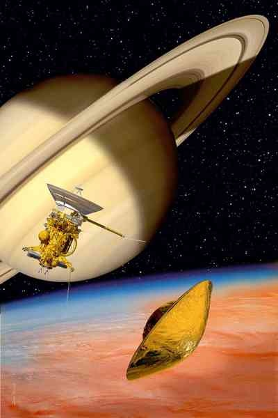
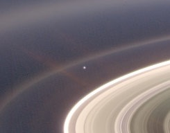
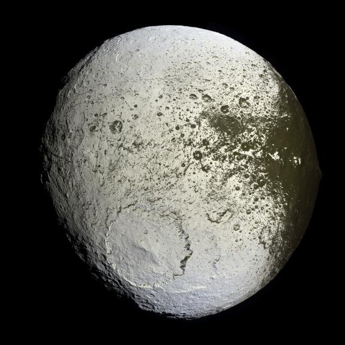
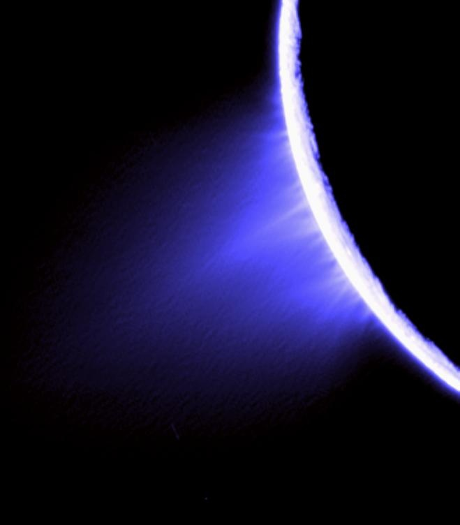

La sonde [Cassini-Huygens](http://www.techno-science.net/?onglet=articles&article=13) a été lancée il y a exactement 10 ans. Après [7 ans de voyage et 5 milliards de km](http://www.techno-science.net/?onglet=articles&article=13&page=2), elle se met en orbite autour de Saturne et [largue Huygens sur Titan](http://www.techno-science.net/?onglet=articles&article=13&page=10) le jour de Noël 2004.

Huygens se pose sur Titan en transmettant des images de la descente vers le plus grand satellite de Saturne. Titan devient ainsi l'astre le plus lointain sur lequel un objet construit de la main de l'homme se soit posé.

Cassini continue à tourner autour de Saturne en fournissant une moisson incroyable d'informations et d'images fantastique, comme la [fantastique photo de la terre prise à travers les anneaux de Saturne](/2006/12/29/les-meilleures-photos-dastronomie-2006/) !

Plus récemment, c'est la lune [Japet](/2007/09/14/japet-de-saturne-par-cassini/) qui reçoit la visite de la sonde Cassini. Cet astre a deux particularités très étranges:

1. un bourrelet qui forme un chaine de très haute montagnes tout autour de son équateur, dont j'ai déjà parlé ici
2. une surface de deux couleurs très différentes que l'on [commence seulement à expliquer](http://www.futura-sciences.com/fr/news/t/astronomie/d/un-debut-dexplication-pour-lenigme-de-japet_13164/), mais qui produit des photos magnifiques :

Cassini a également permis de découvrir des geysers sur Encelade, qui crachent dans l'espace de l'eau et des "traces de matière organique" qui permettent de penser qu'un océan chaud et peut-être "vivable" se cache sous la banquise de glace fissurée qui couvre la planète (plus d'infos [ici](http://www.techno-science.net/?onglet=news&news=4619)).

 _Panaches de vapeur d'eau d'Encelade_

Cassini va encore produire des résultats extraordinaires pendant plusieurs mois au moins, et rejoindra ainsi la longue liste des missions d'exploration de notre Système Solaire par des sondes automatiques, qui ont fourni 99,99% de nos connaissances sur le sujet.

Le 0.01% restant, ce sont les cailloux ramenés par les astronautes de la Lune dans les années 1970, missions affreusement chères et horriblement risquées que certains voudraient répéter pour aller planter un drapeau ...
