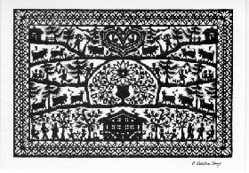
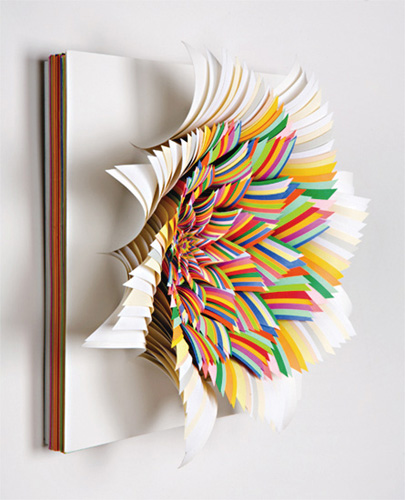
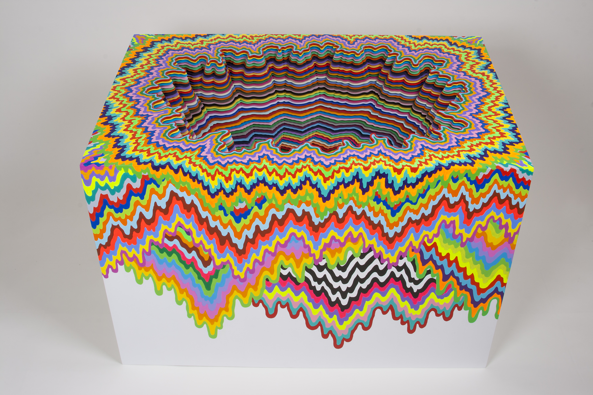

Dans l'art du découpage, je connaissais ça :

 _(oeuvre d'[Anne-Marie Vallotton - Saugy](http://www.decoupage.ch/fr/presentation_fr/page_principale.htm))_

Là je viens de tomber sur le travail de [Jen Stark.](http://www.jenstark.com/index.html) C'est plus ... comment dire ... coloré ?

3D ?

