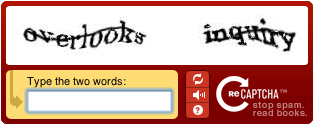

Voici deux problèmes qui n'ont apparemment rien en commun:

1. beaucoup de sites internet ont besoin de s'assurer que celui qui remplit un formulaire est bien un humain, et pas un programme créé par un pirate pour abuser des possibilités du site
2.  il existe des tonnes de documents anciens difficilement lisibles que l'on souhaite numériser, mais les logiciels d'OCR (reconnaissance des caractères) ne sont pas assez efficaces.

Une solution au problème 1 courament utilisée est le "[captcha](w:)" : on affiche une image contenant un texte assez déformé, et on demande à l'utilisateur de taper au clavier les lettres qu'il lit, ce qu'un programme ne peut pas faire.

L'idée géniale de [ReCaptcha](http://www.google.com/recaptcha) est d'utiliser ceci pour résoudre aussi le problème 2 : on présente à l'humain potentiel des mots scannés sur des documents illisibles et on lui demande de les taper. Les utilisateurs d'internet font donc le travail de rats de bibliothèque gratuitement ! Génial non ?

En pratique, il faut quand même valider à la fois l'humanité de l'utilisateur (problème 1) et la justesse de la lecture (problème 2), donc on présente 2 mots à lire, dont un que l'on connait pour l'authentification, et l'autre dont on compare statistiquement les lectures par de nombreuses personnes pour le valider.

Donc la prochaine fois que vous verrez une boite de dialogue comme celle ci-contre, vous serez doublement valorisés. D'une part vous ferez (enfin) un travail dont un ordinateur est incapable, et d'autre part, vous contribuerez à immortaliser des documents anciens.

Source: [BBC NEWS | Technology | Spam weapon helps preserve books](http://news.bbc.co.uk/2/hi/technology/7023627.stm)
