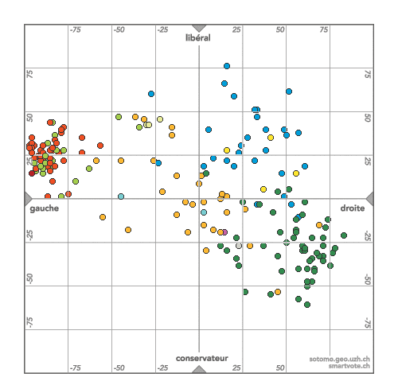

Le désormais fameux site [smartvote.ch](http://smartvote.ch) présentait le profil des candidats au [Conseil National](http://www.parlament.ch) sur un plan défini par deux axes : le traditionnel "gauche/droite" auquel on ajoute verticalement un axe "libéral/conservateur" (voir "[Politique à 2 dimensions](/2007/08/24/politique-a-2-dimensions/))

[smartvote.ch](http://smartvote.ch) permet maintenant de visualiser les résultats de l'élection dans cette représentation, et de se livrer à une petite analyse du positionnement politico-marketing des partis, et de l'UDC en particulier

 PRD  PSS  PDC  UDC  Les Verts  PLS  PEV

_(Note préliminaire: vous ne trouverez cette carte nulle part ailleurs qu'ici, car smartvote ne fournit ces cartes que canton par canton. J'ai réalisé la carte ci-dessus à l'aide de 2 outils indispensables (SnagIt et [ImageMagick](/2008/05/10/imagemagick/)). Veuillez créer un lien vers ce blog si vous reprenez l'info. Merci ! )_

Petite analyse de cette carte :

1. L'axe "libéral/conservateur" devrait être rebaptisé "progressiste/conservateur", car "libéral" est associé à des idées de droite, alors que la gauche+verts est située à la même hauteur que le parti radical par exemple.
2. D'ailleurs, selon cette carte, les élus du parti Libéral ne sont pas plus libéraux que les radicaux, et même pas plus que les socialistes ou écologistes ...
3. La "polarisation" entre socialistes+verts et UDC est manifeste. Ces deux groupes forment des blocs bien compacts aussi opposés sur l'axe gauche/droite que sur l'axe "progressiste/conservateur". Comparativement, le PRD et le PDC sont bien dispersés ...
4. Contrairement à ce que prétend la presse, on ne voit pas de fracture entre des ailes "gauche caviar" et "travailleurs syndiqués" au PSS. Par contre la superposition avec le positionnement des Verts est spectaculaire.
5. Pas de doute, l'UDC est bien à droite. Mais ce qui la distingue encore plus clairement des autres partis, c'est son aspect conservateur : l'UDC est le seul parti nettement positionné sous l'axe horizontal.

A mon humble avis, la progression de l'UDC est le résultat d'un **positionnement marketing soigné**, basé sur quelques constatations clé :

1. la population suisse vieillit, les vieux votent plus que les jeunes, et les vieux sont plus conservateurs que les jeunes.
2. le PDC, traditionnel défenseur de valeurs traditionnelles, s'est rajeuni et est devenu progressiste (1)
3. le PRD est en train de faire la même erreur... (2)
4. même la gauche n'a plus d'aile conservatrice. Si on est un "vieux communiste", on a le choix entre voter "socialiste progressiste" ou "conservateur populiste, hélas de droite"...

Christoph Blocher a donc habilement positionné l'UDC pour récupérer les voix de ceux qui ont peur. Peur des jeunes, des étrangers, de l'avenir, de l'Europe, peu importe de quoi on a peur, seul l'UDC rassure les conservateurs. Tant que les autres partis ne partiront pas à la reconquête de leur électorat agé, l'UDC progressera.

A noter que l'UDC a deux excellentes raisons d'être xénophobe : le conservatisme, et le fait que les étrangers sont ... jeunes !

### Notes:

1. Preuve du point 4.1 : la jeune PDC Ruth Metzler (reviens Ruth!) s'est fait virer du Conseil Fédéral par Blocher, avec l'aide active des conservateurs PDC et passive du conservateur Deiss ...
2. Heureusement, le PRD a deux conseillers fédéraux agés, donc conservateurs, donc acceptables par l'UDC. Attention à ne pas élire un jeune loup pour succéder à Couchepin ...
