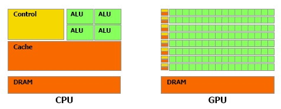

Dans les ordinateurs vendus depuis 2003 environ, le microprocesseur (CPU) fourni par Intel ou AMD n'est plus le composant le plus puissant, et souvent plus le plus couteux non plus. Désormais c'est le GPU, le Graphics Processing Unit, qui détermine largement la puissance d'un PC. Strictement limités au graphisme il y a peu, ces processeurs sont désormais capables d'effectuer certains calculs nettement plus vite que les processeurs classiques. Actuellement, la puissance de calcul du G80 de nVidia est 5 à 6 fois supérieure à celle du Core 2 Duo d'Intel, voire plus (1, 2).

 _puissance de calcul des GPU et CPU ([source : BeHardware](http://www.behardware.com/articles/659-1/nvidia-cuda-preview.html))_

### Conséquence immédiate :

Si vous achetez un ordinateur pour y faire fonctionner les applications les plus exigeantes, c'est-à-dire les jeux vidéo, il faut faire plus attention au choix du GPU qu'au CPU. Vous ne gagnerez que quelques pourcents de performance avec un CPU plus rapide qui vous coûtera quelques centaines de francs, alors que la même somme investie dans une carte graphique basée sur un GPU plus récent ou puissant peut doubler le nombre d'images / seconde (fps) de vos applications favorites.

### Un peu d'architecture des processeurs

Cette situation est la conséquence de cahiers des charges différents assignés aux deux composants:

- le CPU est "généraliste" : il doit être capable d'exécuter plusieurs programmes différents quasi simultanément, de réagir aux actions de l'utilisateur et de gérer les nombreux périphériques de l'ordinateur, fonctionnant à des vitesses différentes
- le GPU est historiquement spécialisé : sa tâche est de produire des images à une cadence régulière, ce qu'il peut faire en exécutant le même programme simple sur des données différentes, correspondant par exemple à des objets 3D distincts ou à des portions distinctes de l'écran.

Ceci a conduit à des architectures différentes pour les deux types de processeurs :

- les CPU comportent aujourd'hui 2 ou 4 "coeurs" complexes accédant aux données à travers une grande mémoire cache, le tout synchronisé par une importante logique de contrôle
- Sur la même surface de silicium, un GPU moderne contient jusqu'à 128 unités de calcul simples, mais très peu de mémoire cache et de logique de contrôle.

_architecture des GPU et CPU ([source : BeHardware](http://www.behardware.com/articles/659-1/nvidia-cuda-preview.html))_

Cette différence d'architecture fait qu'il n'est pas possible d'exécuter sur le GPU un programme "classique", écrit pour le CPU car:

- les unités de calcul (ALU) du GPU sont individuellement moins puissantes qu'un coeur de CPU.
- Un GPU est un processeur SIMD, ou "Single Instruction Multiple Data" : toutes les ALU d'un GPU doivent exécuter le même programme en même temps, alors que chaque coeur de CPU peut exécuter des programmes distincts de façon asynchrone (MIMD)
- les échanges de données entre les ALU de GPU sont beaucoup plus limités qu'entre des coeurs de CPU
- la structure "pipeline" des GPU fait que leurs performances sonttrès dégradées dès qu'il y a des tests dans le programme. Il faut programmer les GPU sans "if ... then .. " !

La principale conséquence de ces différences hardware est que les langages de programmation usuels ne sont pas adaptés à la programmation des GPU. Des langages spécifiques ont été définis, initialement pour la programmation des "shaders", programmes réalisant tous les effets graphiques des cartes modernes. Mais ces langages permettent aussi la "programmation générale des GPU" (ou [GPGPU](http://gpgpu.org)), dont j'ai déjà parlé [ici](/2007/05/19/gpus-et-physique/), [là](/2007/08/22/progres-en-mecanique-des-fluides/), et [là](/2007/05/02/relativite-en-temps-reel-2/) :

- nVidia a défini le langage [Cg](http://developer.nvidia.com/cg-toolkit) comme "C pour graphiques"
- ATI a plutôt soutenu le standard [GLSL](http://www.opengl.org/documentation/glsl/) défini par le standard [OpenGL](http://www.opengl.org/)
- Microsoft a encore une fois grandement contribué aux progrès de l'humanité en dotant son système maison Direct3D d'un langage de shader dont l'innovation essentielle consiste à changer une lettre au standard . C'est HLSL. (Non, pas de lien pour eux, z'avez qu'à chercher.)
- nVidia a par contre fait un réel pas en avant en proposant son système [CUDA](http://developer.nvidia.com/category/zone/cuda-zone) qui permet de développer directement ses GPU haut de gamme en C "classique" , à l'aide de librairies spécifiques.

### Perspectives

Du point de vue matériel, les processeurs du futur combineront sans doute les avantages respectifs des GPU et des CPU. Voici la stratégie probable des principaux acteurs du marché :

- Après le rachat d'ATI, AMD a tout en main pour combiner les deux types de processeurs de façon optimale
- intel, dont les GPUs ont des performances lamentables, essaie de multiplier le nombre de coeurs de ses CPU tout en s'inspirant de certaines techniques des GPU
- nVidia va logiquement tenter de généraliser ses GPU pour leur permettre d'exécuter du code de CPU
- On l'oublie souvent, mais le processeur [Cell](http://www.research.ibm.com/cell/)  d'IBM développé en collaboration avec Toshiba et Sony pour la Playstation 3 est probablement le précurseur de cette nouvelle génération de processeurs.

Du point de vue logiciel, deux tendances s'affrontent:

- la définition de langages spécifiques comme GLSL, ou prenant en compte explicitement le parallélisme à la manière des librairies de multithreading existantes
- le développement de compilateurs capables de générer du code GPU optimisé à partir de sources en langages classiques, à la manière de CUDA

Il est probable que dans un premier temps les langages comme GLSL jouent le rôle d' "assembleur des GPU" utilisé pour la création de librairies, que des applications en C utiliseront de manière transparente.

### Sources:

1. Damien Triolet "[Nvidia CUDA: preview](http://www.behardware.com/articles/659-1/nvidia-cuda-preview.html)", BeHardware, March 21, 2007
2. Jean Etienne, "[Une méthode de décryptage qui inquiète](http://www.futura-sciences.com/fr/news/t/informatique/d/une-methode-de-decryptage-qui-inquiete_13423/)", Futura-Sciences, 31 octobre 2007
