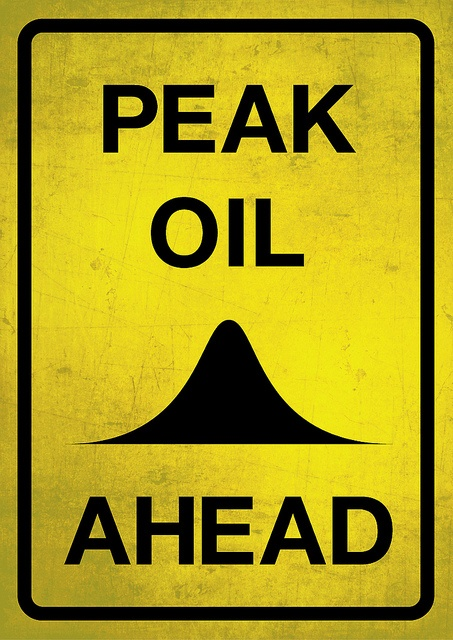

Pierre est un doux rêveur. Il m'a transmis un appel au boycott des compagnies Shell et Exxon dans l'espoir de faire baisser le prix de l'essence.

Quelques infos et idées en vrac pour commencer :

1. [cet appel au boycott circule depuis 2002](http://www.hoaxbuster.com/hoaxliste/hoax_message.php?idArticle=6923). En 2005, l'article [Le prix de l’essence... sur LostHighway](http://www.ikiru.ch/blog/2005/le-prix-de-lessence) en discutait déjà fort à propos.
2. En Suisse sur un carburant vendu 1 fr. 80 le litre, seuls 80 centimes sont liés au coût du produit. Le reste finance des taxes d'importation, des impôts (74,5 centimes), la distribution et la TVA ([article dans 24 heures d'hier](http://www.24heures.ch/pages/home/24_heures/l_actu/economie/detail_economie/\(contenu\)/149681)). Boycottez plutôt les impôts !
3. Le prix du pétrole n'est plus dicté par les compagnies pétrolières depuis la première crise du pétrole en 1973, quand les pays membres de l'OPEP ont nationalisé leur production et fixé un prix de vente (quadruple des redevances qu'ils touchaient précédemment) aux compagnies. Depuis, le prix du pétrole est uniquement dirigé par l'offre et la demande sur les marchés internationaux (très intéressant article [ici](http://www.ceras-projet.org/index.php?id=1945)). Il en résulte que transférer nos achats d'une compagnie vers une autre n'aura strictement aucun effet sur les prix.
4. Une faible baisse des prix peut théoriquement être causée par une baisse de la demande. Plus radical que d'économiser quelques réservoirs de voiture, ne faites pas le plein de mazout de chauffage, et priez pour que l'hiver soit clément : ça ça représente une baisse de demande importante ...
5. En fait c'est plutôt du côté de l'offre qu'il faut regarder. Actuellement, l'Arabie Saoudite est le seul pays capable d'ouvrir les vannes pour produire plus. Tous les autres pays sont au maximum de leurs possibilités (voir plus bas pourquoi) En plus les incertitudes politiques font que la spéculation est plutôt à la hausse, donc que les prix sont proches de leur maximum. (Rappel : vous faites de la spéculation quand vous remplissez votre citerne ou votre réservoir lorsqu'il n'est pas vide, croyant que le prix va augmenter...) Or l'Arabie Saoudite n'a aucun intérêt à ce que les prix baissent (voir [cet article par exemple](http://www.ledevoir.com/economie/actualites-economiques/161260/les-pays-petroliers-retrouvent-leur-pouvoir-d-achat-des-annees-80)).
6. La situation redeviendra "normale" lorsque la pression politique sur l'Iran (et la région) s'abaissera, et que la demande baissera (au printemps), ce qui fera que les pays producteurs seront de nouveau en surcapacité, donc en concurrence.

A part celà j'en reviens à deux notions plus fondamentales:

1. l**'essence est extraordinairement bon marché !** Comme je l'ai montré dans "[on brulera tout !](/2004/06/29/on-brulera-tout/)", l'énergie contenue dans un litre d'essence sera au même prix que celui de l'électricité quand l'essence (taxée) coutera Frs 3.- (= €1.70). Si on ne tient pas compte des taxes, le prix de l'essence (80 cts) peut **quadrupler** avant de couter aussi cher que l'électricité (ou que l'[hydrogène](/2004/06/29/on-brulera-tout/), en passant)
2. Pour savoir ce qui nous attend, il faut absolument connaitre la notion de "**[pic pétrolier](w:)**". C'est un peu technique, mais indispensable de bien comprendre :
    1. la consommation de pétrole dans le monde s'accroit (Chine, Inde en veulent aussi)
    2. dans le temps on trouvait très facilement des gisements de pétrole. Maintenant on en trouve de nouveaux de moins en moins souvent
    3. le "pic pétrolier" (ou "[Peak Oil](w:en)") correspond à l'année ou on découvre moins de "nouveau" pétrole que l'augmentation de la demande. A partir de ce moment, on doit commencer à "taper dans les réserves" : ça s'appelle la "déplétion".
    4. Le pic ne correspond pas (encore) à un manque de pétrole pour satisfaire la demande, mais la théorie indique que le pic pétrolier a lieu au moment ou la moitié du pétrole a été extrait, et les mesures correspondant aux nombreux pays qui ont dépassé ce pic plus ou moins largement (Iran et Norvège par exemple) confirment l'exactitude de la prédiction.
    5. Ces mesures montrent aussi clairement que les "réserves prouvées" de pétrole annoncées par les compagnies pétrolières sont largement surévaluées : il y a moins de pétrole dans le sol que ce que Shell prétend. Mais si elle l'avoue, ses actions chutent...
    6. la plupart des experts estiment que le pic pétrolier mondial a déjà eu lieu, ou aura lieu entre 2006 et 2015.
    7. à partir d'à peu près maintenant, la production mondiale va irrémédiablement baisser progressivement et il va être de plus en plus difficile de produire la quantité croissante de pétrole demandé : les prix vont irrémédiablement monter
    8. Seuls les pays qui n'ont pas atteint leur "pic pétrolier" (comme l'Arabie Saoudite, encore!) auront la possibilité d'augmenter temporairement leur production pour maintenir les prix à un niveau acceptable pour eux ! Et comme il est montré dans "[on brulera vraiment tout](/2007/05/25/on-brulera-vraiment-tout/)", le prix maximum admissible pour le producteur de pétrole est celui de la technologie de substitution la meilleur marché.

**Conclusion : le prix de l'essence augmentera rapidement (en quelques années) jusqu'autour de Frs 4.- (actuels, soit ) le litre :**

- 3 Frs pour l'énergie, au même prix que l'énergie de substitution électrique ou hydrogène
- \+ 1 Frs de taxes etc comme maintenant.

