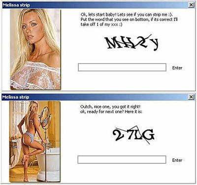

[Il y a peu](/2007/10/16/recaptcha-quand-linternet-utilise-les-cerveaux-humains/) je vous expliquais ce qu'étais un captcha et comment certains avaient eu l'idée constructive d'utiliser les facultés de reconnaissance de caractères uniques du cerveau humain pour digitaliser des documents du passé.

Mais la créativité malice humaine est décidément sans limite. De joyeux pirates ont eu une remarquable idée pour contourner les captchas, et de ce fait continuer à générer automatiquement et en très grand nombre des adresses email du genre me28345@hotmail.com à partir desquelles, tout aussi automatiquement, ils inondent le monde de spams. Ils ont pondu un petit jeu ou une jolie nana vous propose de se déshabiller image par image si vous résolvez un captcha ! Donc les pirates vous mettent à contribution (petits voyeurs) pour les aider à contourner une mesure très efficace.

Quand on y pense, c'est quand même très fort : un programme se sert d'êtres humains (un peu primaires quand même) pour faire croire à un autre programme qu'il est humain...

A part ça, ce programme connu sous le nom de "Melissa" est en fait un Cheval de Troie nommé "Captchar" qui établit une connexion cachée avec un serveur distant à l'insu des néophytes, donc c'est une menace potentielle pour la sécurité de votre système. Attention donc ...

### Références:

- [Le retour de Melissa (toute nue)](http://magazine.qualys.fr/menaces-alertes/le-retour-de-melissa-toute-nue/)
- [Une technique astucieuse d'ingénierie sociale : le strip-tease](http://magazine.qualys.fr/menaces-alertes/une-technique-astucieuse-dingenierie-sociale-le-strip-tease/)
- [Virus profile : Captchar](http://home.mcafee.com/VirusInfo/VirusProfile.aspx?key=143504)
