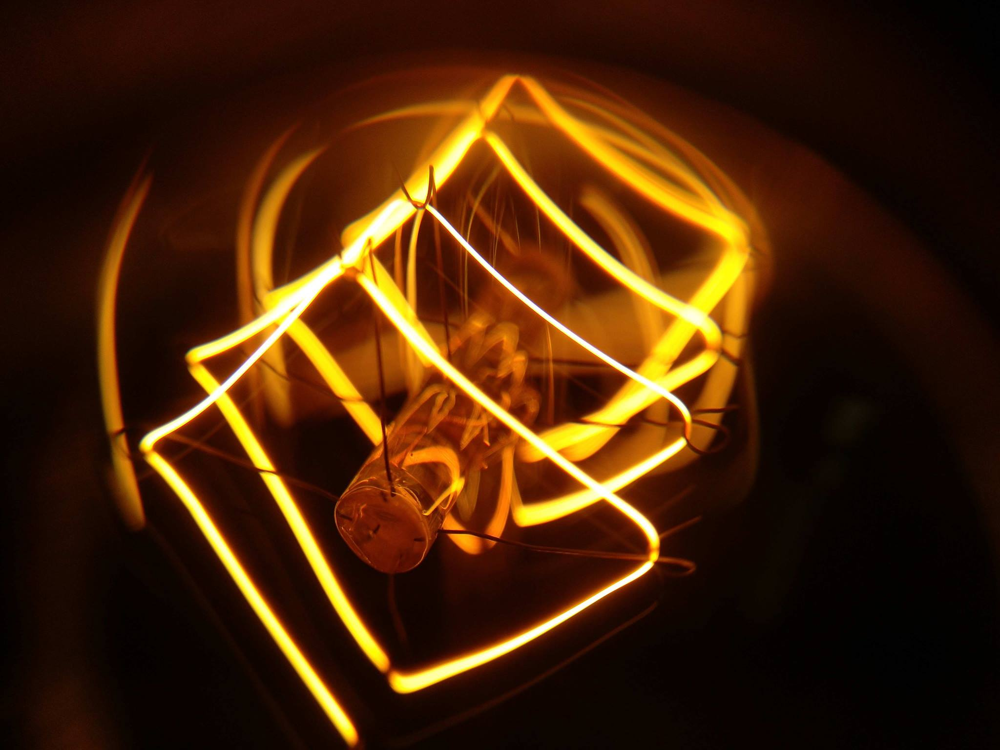

Julia m'a collé avec un petit problème de logique. Il est [tellement connu](http://www.google.ch/search?q=trois+interrupteurs) que j'ai hésité à lui consacrer un article, mais après avoir donné ma "langue au chat", j'ai eu tellement honte que je dois expliquer pourquoi. Vous allez comprendre.

Le problème : dans une pièce se trouvent 3 interrupteurs, dont un seul allume ou éteint une ampoule placée dans une autre pièce. On n'a le droit d'aller dans cette autre pièce qu'une seule foi, et pas moyen de voir autrement si l'ampoule est allumée ou éteinte. La question : comment savoir quel interrupteur commande la lampe ?

Le problème dans ces articles sur les casse-tête, c'est de savoir s'il faut donner la solution, ou pas, ou un indice avant, et comment forcer le lecteur à réfléchir plutôt que de se précipiter sur la solution en cliquant un lien ...

Alors ici, je vous propose de lire [un article](http://drgoulu.local/2007/11/07/ampoules-a-faible-consommation/) que je venais d'écrire et qui contient l'indice, d'où ma honte à ne pas y avoir pensé... Et si vous ne trouvez toujours pas, [visitez cette page](http://bric-a-brac.org/enigmes/reflexion/trois_interrupteurs.php), qui présente le problème, un indice et la solution d'une manière intelligente.
