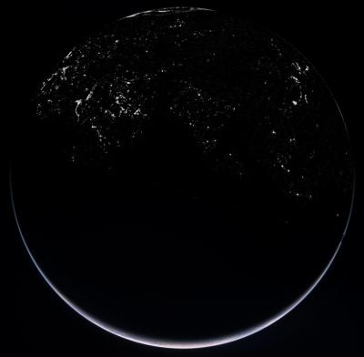
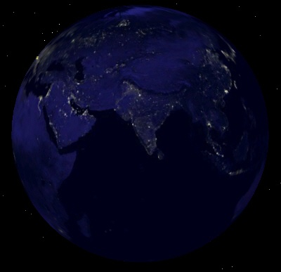

La sonde Rosetta en route pour la comète "Churyumov-Gerasimenko" vient de repasser près de la Terre en prenant cette magnifique image de notre planète, avec ses villes illuminée :

Dans les commentaires de l'article [source sur Centauri Dreams : "A Technological Civilization by Night"](http://www.centauri-dreams.org/?p=1582) un fan de Google Earth explique comment visualiser la même image à partir de photos prises par la NASA :

1. utiliser [ce fichier Google Earth](http://www.gearthblog.com/kmfiles/rosettasim.kmz) spécialement préparé par ses soins
2. sélectionner la couche Galerie/Nasa/Earth City Lights

On obtient l'image "langue au chat" suivante, car moins noire elle permet de retrouver ses repères géographiques :

Si vous n'aviez pas vu l'Afrique, c'est normal : elle est noire ... ou très économe en énergie, au choix.
