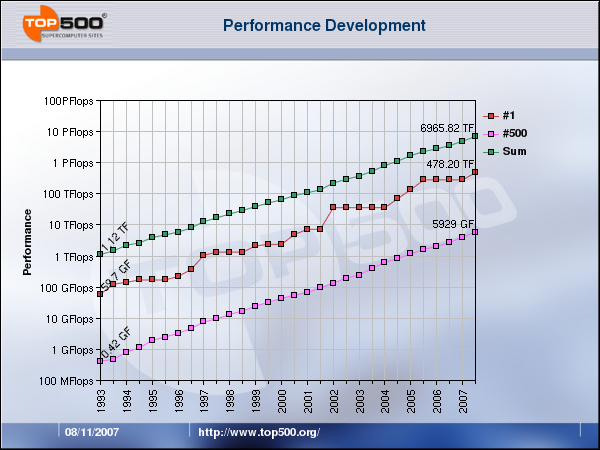

L'article "[Supercalculateurs : les processeurs multi-coeurs bousculent le Top 500](http://www.futura-sciences.com/fr/news/t/informatique/d/supercalculateurs-les-processeurs-multi-coeurs-bousculent-le-top-500_13697/)" sur Futura-Sciences donne quelques infos intéressantes sur les [500 ordinateurs les plus puissants](http://www.top500.org/) du monde actuellement :

1. La puissance de calcul cumulée des 500 supercalculateurs les plus puissants du monde équivaut à 6,97 PFlops (pétaflops), soit pratiquement le double des 3,54 PFlops d'il y a un a. La Loi de Moore est donc toujours aussi remarquablement vraie :
    
     puissance de calcul du plus puissant ordinateur du monde (#1), du 500ème et de la somme des 500 Attention : l'échelle vertical est logarithmique : chaque division correspond à 10x la puissance de celle d'en dessous !
    
2. Le BlueGene/L installé au _Lawrence Livermore National Laboratory_ est l'ordinateur le plus puissant du monde depuis 2004. Il dispose désormais de 32x32x64 = [106.496 nœuds de calcul biprocesseur disposés en tore 3D](https://asc.llnl.gov/computing_resources/bluegenel/configuration.html), délivrant 478,2 TFlops (contre 280,6 TFlops en juin dernier)
3. Les Xeon double coeur d'Intel équipent 43% des supercalculateurs, et les quadruple coeur déjà 20% ! Mais les PowerPC d'IBM équipent toujours 34% des 50 machines les plus puissantes, dont le BlueGene/L, et AMD se maintient autour de 10% de parts de marché, notamment grâce à Cray qui va équiper son XT5 avec des AMD Opteron
4. Le projet [Folding@Home](http://folding.stanford.edu/), qui utilise une "grille" formée par les machines mises à disposition sur internet par les particuliers lorsqu'is ne s'en servent pas, a disposé le 15 septembre d'une puissance de calcul de 1 Petaflop, soit le double du BlueGene/L ! Cette puissance a été fournie à 60% par des consoles de jeu [PlayStation 3 de Sony](http://folding.stanford.edu/English/FAQ-PS3) mues par le processur Cell d'IBM qui est en quelque sorte un PowerPC avec 8 coprocesseurs vectoriels.

Tout ça doit [chauffer pas mal](http://drgoulu.local/2007/11/17/radiateurs-a-teraflops/) ...
