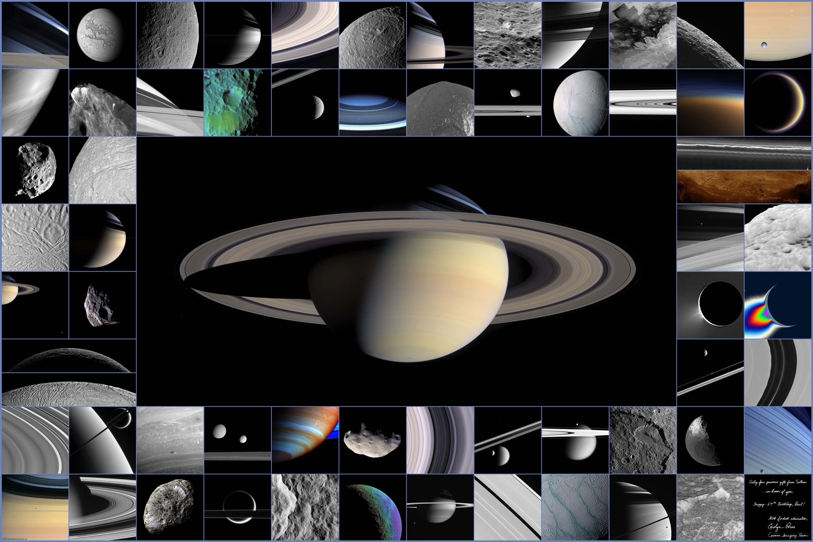

Dans [Cassini Forever](http://drgoulu.local/2007/10/15/cassini-forever/) je vous offre la video "[Sixty-Four Scenes from Saturn"](http://ciclops.org/view.php?id=24) regroupant les meilleures images de la banlieue de Saturne prises par la sonde Cassini. Le poster correspondant est dorénavant disponible [ici sur le site CICLOPS](http://ciclops.org/view.php?id=2879) en résolution 11560 x 7708 si vous disposez d'une imprimante grand format, et ci-dessous au format 2890x1927, bien assez pour faire un magnifique fond d'écran :

