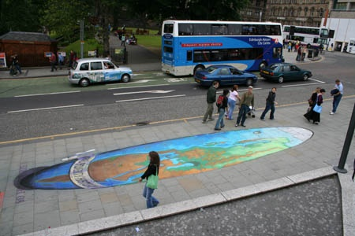
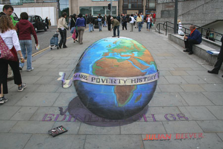

[Julian Beever](http://users.skynet.be/J.Beever/pave.htm) est le maitre incontesté de l'anamorphose de rue. Il dessine à la craie sur les trottoirs des choses comme ça :

Rien de bien spécial, sauf si on le regarde d'un point précis, et de là on voit ceci:

Remarquez l'artiste jouant au golf au pôle nord, causant une illusion d'optique spectaculaire !

Et voilà les oeuvres que je préfère, présentées grâce à [Slide.com](http://www.slide.com/)

\[slideshow id=792633534426062334&w=426&h=320\]
