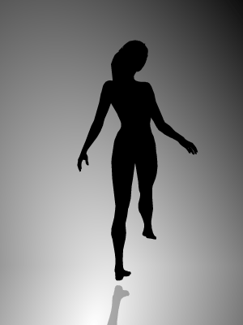

J'aime bien cette petite danseuse qui me rappelle le [Shadow](https://goulu.wordpress.com/2006/01/30/las-vegas/) à Las Vegas...  Mais dans quel sens tourne-t-elle ?

D'après cet [article du Herald Sun](http://www.heraldsun.com.au/news/right-brain-v-left-brain/story-e6frf7jo-1111114603615), ça dépend de votre hémisphère cérébral préférentiel, droit ou gauche. Si vous arrivez à la voir tourner dans les deux sens, bonne nouvelle : votre cerveau a deux hémisphères ...

Je n’arrive pas à la faire changer de sens en regardant, mais en la quittant des yeux, en pensant à une direction et en la re-regardant, elle m’obéit presque toujours. Mais le plus souvent elle tourne « anti-clockwise », un terme très négatif, je préfère « trigonométrique positif »…
