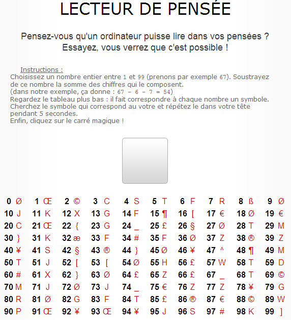

[Ca devient une habitude](/2007/04/18/multiplication-graphique/), je vais expliquer à Yves comment marche le truc du [Lecteur de pensée](http://www.k-netweb.net/projects/mindreader/). C'est pas pour retourner le couteau dans la plaie, mais un minimum de maths, ça aide, dans la vie. Il m'a fallu 10 secondes pour deviner à l'avance que le symbole qui allait apparaître en cliquant sur le carré serait le Ø quelque soit le nombre que j'avais choisi.

La raison c'est que 10.x + y -x - y = 9x

Autrement dit, quand vous choisissez un nombre entre 01 et 99 et que vous appelez x les dizaines et y les unités, votre nombre est "xy" est égal à 10.x + y. En enlevant les dizaines et les unités, les unités ne jouent plus aucun rôle et le nombre que vous obtenez est un multiple de 9 inférieur à 90. Et en examinant la table on voit que tous les multiples de 9 inférieurs à 90 correspondent au même symbole, le "Ø" quand j'ai essayé.
