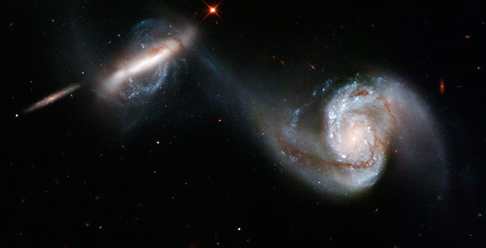
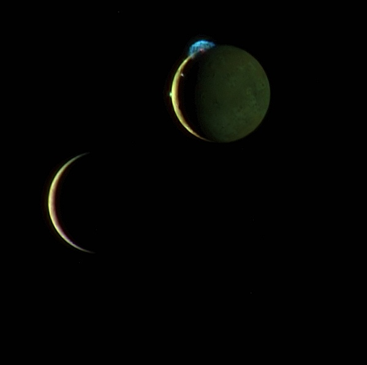
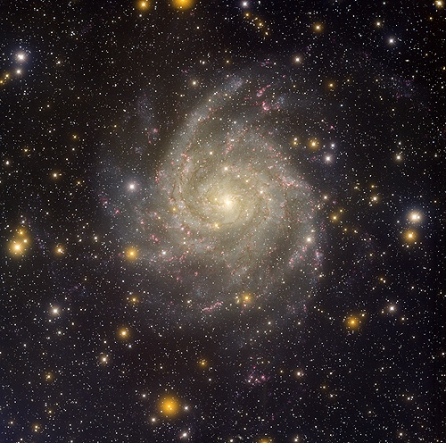

[Une année que j'attendais ça](/2006/12/29/les-meilleures-photos-dastronomie-2006/) : le blog [Bad Astronomy a publié son "Top Ten Astronomy Pictures of 2007"](http://blogs.discovermagazine.com/badastronomy/) et il y a une fois encore des merveilles.

- Arp 87 est une paire de Galaxies en interaction, photographiée par Hubble, et disponible en plein de résolutions différentes [ici](http://www.spacetelescope.org/images/heic0717a/) :

- Deux lunes de Jupiter, Europa et Io, photographiées d'un coup d'un seul par la [sonde "New Horizons"](http://pluto.jhuapl.edu/gallery/sciencePhotos/image.php?gallery_id=2&image_id=58) en route pour Pluton (arrivée en 2015...). Io a des volcans très actifs, dont l'un crache dans l'espace des volutes bien visibles :

- En ce qui me concerne, je trouve la [galaxie spirale IC342](http://www.noao.edu/image_gallery/html/im1032.html) magnifique et je comprends que Bad Astronomy l'ait choisie comme meilleure photo astronomique 2007, mais personnellement, ma préférée c'est la nébuleuse de la Voile:

Maintenant, pour une fois, faites ce que je vous dis sans poser de question : suivez [ce lien et zoomez](http://www.skyfactory.org/vela/vela_int.htm) n'importe où sur cette fantastique photo prise avec une caméra ce fantastique montage de photos totalisant plus d'un [gigapixel](/2007/08/19/grandes-images/) ! Oui oui, chaque point est une étoile !
