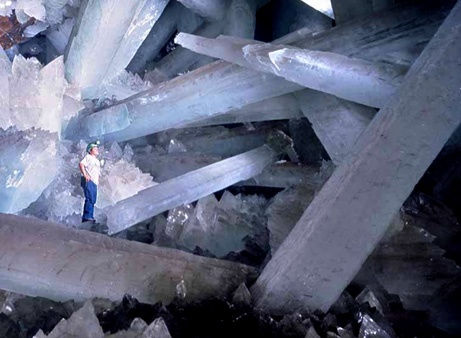
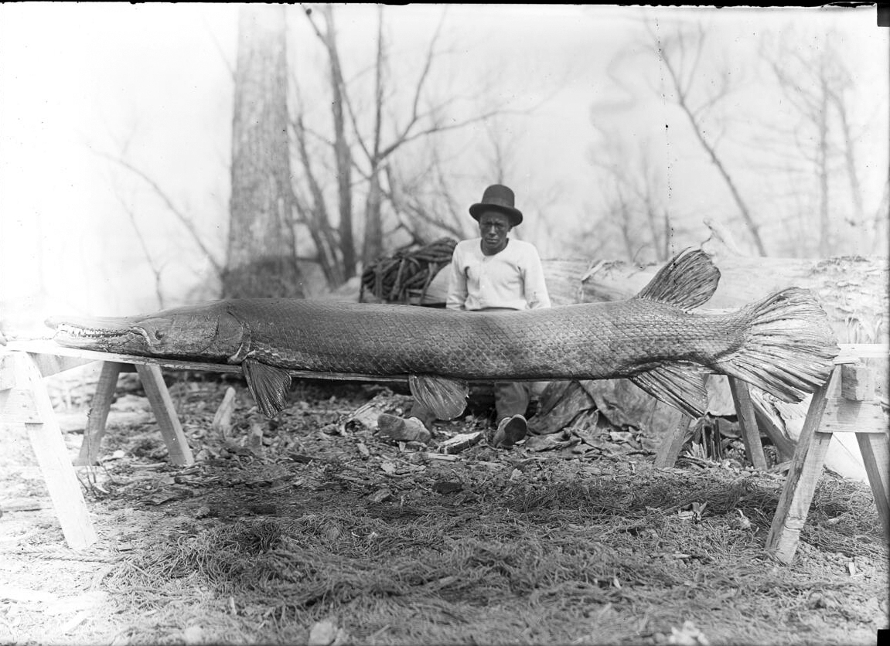

C'est la saison des "Best of 2007". Après un voyage dans l'espace, retour sur Terre avec le [National Geographic qui propose son "Top Ten News Photo Galleries of 2007"](http://news.nationalgeographic.com/news/2007/12/photogalleries/topten-pictures/photo6.html), et même sous terre avec cette photo, ma préférée:

D'autres photos de cette extraordinaire grotte de cristaux géants sont [ici.](http://news.nationalgeographic.com/news/2007/04/photogalleries/giant-crystals-cave/index.html) Elle a été découverte au Mexique, attenante à une mine en exploitation.

Le National Geographic prime aussi la photo scientifique dont j'ai déjà parlé [ici](http://drgoulu.local/2007/09/28/visualisation-scientifique-2007/), et des photos d'animaux comme celle ci, qui représente des poissons de plus 2m vivant réellement et maintenant dans le Mississippi :

