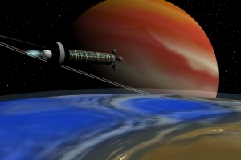
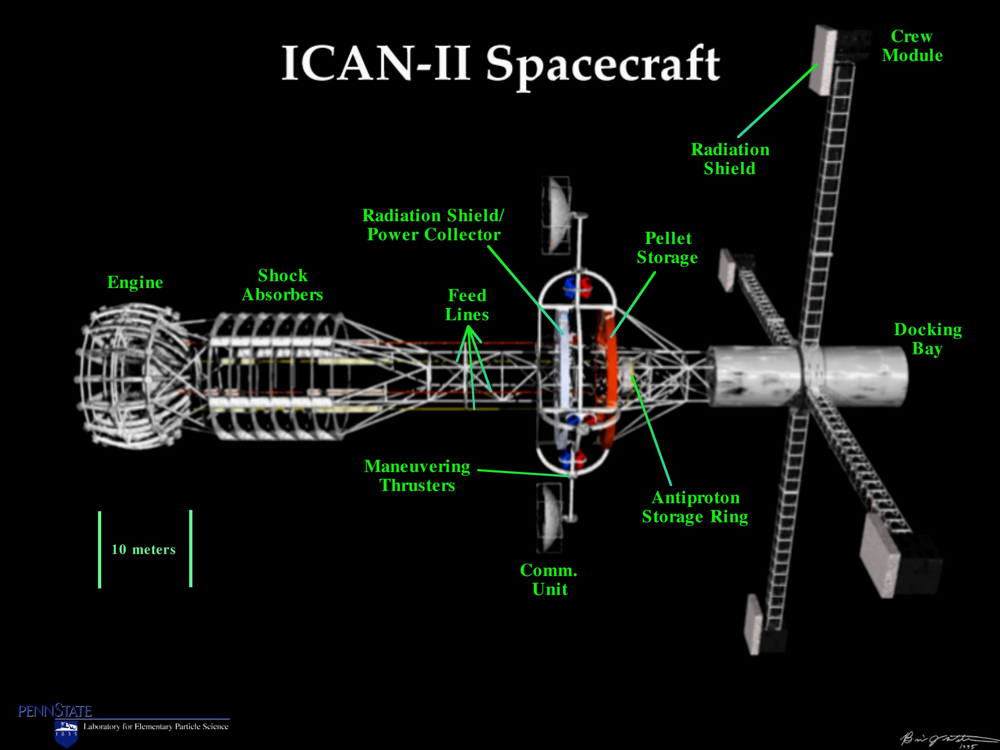

En février, Gilgamesh a publié sur [Parcours Etranges](http://strangepaths.com/en/) un article culte : "[Arche interstellaire](http://strangepaths.com/?p=106&cp=4&language=fr#comments)", dont je vous ai déjà parlé [ici.](/2007/06/06/parcours-etranges/) "Culte" parce que cet article a reçu jusqu'ici plus de 200 commentaires, presque tous constructifs et intéressants, faisant parfois plusieurs pages bien documentées, et que l'on peut suivre facilement grâce au [flux RSS de l'article](http://strangepaths.com/arche-interstellaire/2007/02/14/feed/fr/).

Un thème dominant dans les commentaires est celui de la propulsion interstellaire : quelle source d'énergie et quels moteurs utiliser pour atteindre les étoiles ?

_(approche de Iota Horlogii vue par Christoph Kulmann, [exoplaneten.de](http://www.exoplaneten.de))_

Pour illustrer la difficulté, les [sondes Voyager lancées il y a 30 ans sont actuellement à 1/2 jour lumière de nous](http://www.futura-sciences.com/fr/news/t/astronautique/d/voyager-2-les-surprises-de-lultime-frontiere_13892/), donc environ 1/4000 ème de la distance nous séparant de l'étoile la plus proche... Actuellement, seuls le [moteur ionique](/2007/09/28/qui-veut-voyager-loin-ionise-sa-sonde/) permet d'envisager envoyer des engins plus vite et plus loin, mais sa très faible poussée limite son usage à des sondes automatiques légères.

L'Arche de Gilgamesh utiliserait la [fusion thermonucléaire](/2005/12/11/la-fusion-thermonucleaire/) pour propulser un énorme cylindre abritant 5000 voyageurs vers une étoile proche (10 années lumière) en 700 ans.

Dans "[Accélération](/2004/08/09/acceleration/)", j'ai décrit un voyage de 10 années lumière en 11 ans seulement, mais seulement 3 pour la petite équipe de passagers d'un vaisseau "léger" accélérant jusqu'à la vitesse de la lumière. La technologie de propulsion n'est pas décrite, mais je rêvais à une sorte de réacteur à antimatière catalytique, que Gilgamesh a rapidement démonté (merci ...).

Cependant, Gilgamesh vient d'indiquer dans un commentaire [ce site](http://ffden-2.phys.uaf.edu/213.web.stuff/Scott%20Kircher/antimatter.html) dédié à la propulsion par antimatière. Outre le fait d'être en anglais, ce site est graphiquement horrible, impossible à lire sur ce fond noir et bleu... J'ai fait l'effort pour vous, et voici ce qu'il en ressort:

1. L'[Université de Pennsylvanie](http://www.engr.psu.edu/antimatter/) a proposé un moteur "ACMF" pour "[Antimatter Catalyzed Micro Fission/Fusion](http://ffden-2.phys.uaf.edu/213.web.stuff/Scott%20Kircher/fissionfusion.html)" consistant en gros a faire exploser de minuscules bombes H faites de pastilles d'Uranium, de Deutérium et de Tritium en les bombardant avec des antiprotons. Un vaisseau "ICAN-II" a même été projeté : il ressemblerait à ça: 
    
    Cet engin pourrait emmener quelques personnes vers Mars et retour en 120 jours seulement, en consommant 140 nanogrammes d'anti-protons (qui pourraient être produits en 1 an au CERN par exemple) et 360 tonnes de micro bombes H... Plus d'infos sur ce projet [ici](http://www.engr.psu.edu/antimatter/documents.html).
    
2. Un autre propulseur envisagé par l'[Université de Pennsylvanie](http://www.engr.psu.edu/antimatter/) est l'AIM, pour "[Antimatter Initiated Microfusion](http://ffden-2.phys.uaf.edu/213.web.stuff/Scott%20Kircher/microfusion.html)". Comme pour l'ACMF, il s'agit en fait de fusion déclenchée par des antiprotons. La sonde AIM-Star propulsée par cette technologie serait capable d'aller environ 100x plus loin que les sondes Voyager en 50 ans, mais nécessite 28.5 microgrammes d'antiprotons, donc beaucoup plus que ce que l'on est capable de produire actuellement.
    
3. On pourrait imaginer utiliser de l'antimatière simplement pour chauffer un plasma qui serait expulsé du réacteur, mais ce "[Plasma Core Antimatter Drive](http://ffden-2.phys.uaf.edu/213.web.stuff/Scott%20Kircher/plasmacore.html)", bien que plus simple, n'a pas un rendement aussi bon que les solutions précédentes.
4. Le vrai moteur de science-fiction, c'est le "[Beamed Core Antimatter Drive](http://ffden-2.phys.uaf.edu/213.web.stuff/Scott%20Kircher/beamedcore.html)" dans lequel les particules à très haute énergie produites par l'annihilation sont directement expulsées vers l'arrière du vaisseau à la vitesse de la lumière, et permettent donc d'atteindre des vitesses relativistes. Mais il y a plusieurs "détails" à régler:
    - si j'ai bien compris, le moteur doit faire dans les 2km de long pour bien focaliser les particules
    - le moteur produit des rayons gamma partant dans tous les sens, ce qui nécessite un blindage très important pour protéger les passagers
    - ici, ce sont des tonnes, voire des milliers de tonnes d'antimatière dont on a besoin. Comme le souligne Gilgamesh dans son article, l'énergie dont on parle ici correspond à plusieurs fois les réserves totales d'énergies fossiles disponibles sur Terre. Peu de chances de voir un départ de vaisseau interstellaire dans les prochains siècles donc.
