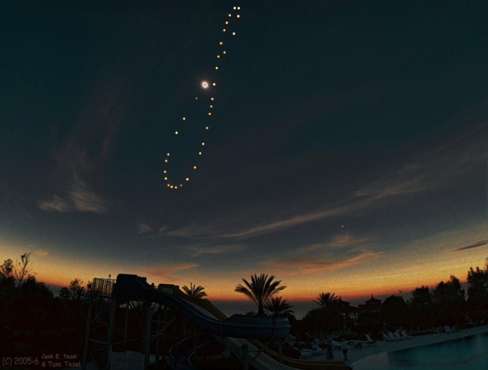

Aujourd'hui Dr. Goulu vous permet d'étendre votre vocabulaire : l'[analemme](w:) est la courbe décrite dans le ciel par la position du Soleil à midi au cours d'une année.

Voici une photo d'analemme obtenu par [Tunc Tezel](http://mstecker.com/pages/apptezel.htm) en Turquie en réalisant et superposant une photo par semaine, dont une pendant l'[éclipse totale du 29 mars 2006](https://web.archive.org/web/20071028103809/http://newton.physics.metu.edu.tr/~aat/TSE2006/TSE2006.html)

