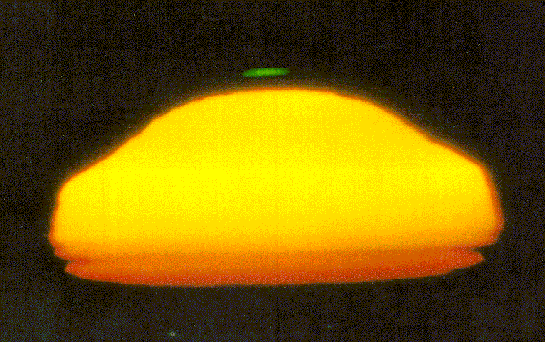
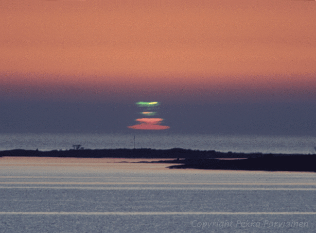

Dans "Pirates des Caraïbes 3" le "rayon vert" permet de revenir du monde des morts. Comme c'est un "green flash" en anglais, Hollywood en a fait un effet spécial spectaculaire, mais existe-t-il vraiment ?

Et bien oui! C'est un [phénomène optique rare](w:Rayon_vert) qui se produit au coucher du Soleil sur la mer, par temps calme : une lueur verte apparait au dessus du Soleil et reste visible après que le disque solaire soit passé derrière l'horizon.

On peut en trouver quelques photos sur le net, souvent de mauvaise qualité car comme le phénomène est imprévisible, il est rarement pris avec le télescope de rigueur, mais voici les meilleures: 

On en trouve quelques unes de plus [sur Flickr en cherchant "green flash sunset".](http://www.flickr.com/search/?q=green+flash+sunset) Il existe quelques vidéos sur YouTube, mais elles sont de trop mauvaises qualité. 

La meilleure que j'aie trouvé [se trouve ici](http://www.well.com/user/pk/waterfront/photo-of-the-week/GreenFlashVideo.avi) :



Je connais une personne qui a vu le "rayon vert" et m'a dit que c'était une expérience inoubliable. Alors regardez bien le soleil couchant quand vous êtes au bord de la mer !

### Références:

- [page très complète](http://mintaka.sdsu.edu/GF/index.html) avec nombreux liens vers des photos
- [autre page sur le sujet](http://mintaka.sdsu.edu/GF/papers/JOSA/GF-vis.html) (ajoutée le 28.5.2011)
