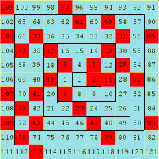
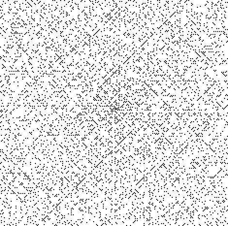
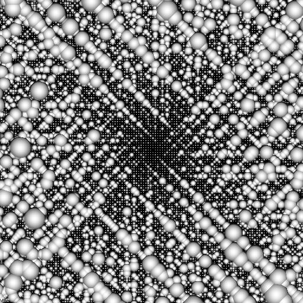
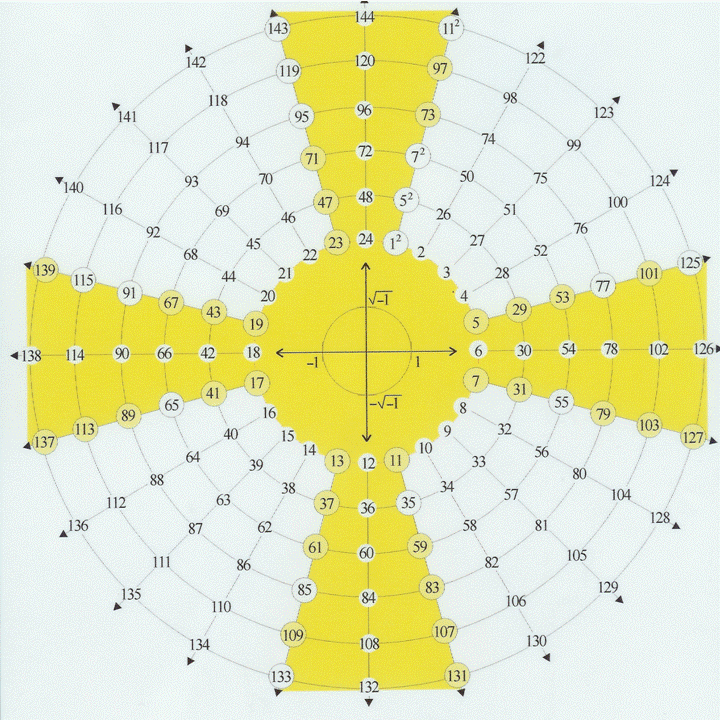

_A l’occasion de la découverte de la plus grande paire de nombres premiers jumeaux, et en parallèle avec la rédaction d’un articule sur le calcul distribué, j’ai partiellement ré-écrit cet article de 2005 sur les nombres premiers._

#### Introduction

Un nombre P est premier s'il ne se divise que par 1 ou lui-même. Il n'est donc "pas dans le livret", autrement dit, il n'existe pas deux nombres entiers A et B plus grands que 1 tels que A x B = P.

Les premiers nombres premiers sont 2,3,5,7,11,13,17,19,23,29,31 ...

Le grands nombres premiers ont une grande importance pratique en cryptographie, donc dans les dispositifs de sécurité informatique ou électronique, les systèmes de paiement etc.

Ces systèmes vitaux actuellement se basent sur des idées connues depuis des millénaires, mais qui n'ont été prouvées que récemment. Par exemple:

1. pour être absolument certain qu'un nombre N est premier, il faut essayer de le factoriser (trouver ses facteurs A et B, par lesquels on pourrait diviser N), ce qui implique d'essayer un grand nombre de divisions, et ça prend beaucoup de temps.
2. il existe des "tests de primalité" qui peuvent dire très rapidement si un nombre est "très probablement" premier ou pas, sans effectuer de factorisation : si le test dit que le nombre n'est pas premier, il n'en fournit pas les facteurs.
3. il n'existe pas de formule qui donnent à coup sur des nombres premiers, mais il en existe qui marchent une 40aine de fois de suite, ce qui n'est pas mal du tout:
    - 103n2\-3945n + 34381 est premier pour n=0,1,...,42 (R. Ruby)
    - 47n2^2-1710n + 10181 est premier pour n=0,1,...,42 (G. Fung)
    - 36n2^2-810n + 2753 est premier pour n=0,1,...,44 (R. Ruby)

### Nombres de Mersenne et grands nombres premiers

Les "nombres de Mersenne" 2n\-1 sont "assez souvent" des nombres premiers, par exemple:

22\-1=3, 23\-1=7, 25\-1=31, 27\-1=127, 213\-1=8191

Comme 2^n-1 est une fonction exponentielle, on peut trouver "facilement" de très grands nombres premiers

En 1588, P. Cataldi calcul a que 217\-1=131071 et 219\-1 = 524 287 sont premiers, puis Euler en 1750 prouva que 231\-1=147'483'647 est premier.

S'ensuivit une course au plus grand nombre premier dont on trouve un [historique sur la Wikipedia.](w:Nombre_premier_de_Mersenne)

En 1878, [Edouard Lucas](w:Édouard_Lucas) énonça un test de primalité très puissant, qui lui permit de prouver que 2127\-1 = 170141183460469231731687303715884105727 est premier, sans effectuer les divisions

les nombres premiers suivants furent découvert dès 1952 avec des ordinateurs.

Actuellement, le plus grand nombre premier connu est 232'582'657\-1. Il fait 9'808'358 décimales et à été découvert en septembre 2006 par le projet [GIMPS](https://web.archive.org/web/20060716015142/http://www.gimps.org), dont je reparle dans un [article sur le calcul distribué](/2007/01/20/calcul-distribue-avec-boinc/).

### Nombres premiers jumeaux

En examinant la différence entre des nombres premiers consécutifs, on s'aperçoit qu'elle vaut plus souvent 2 que toute autre valeur. Il existe donc des nombres premiers "jumeaux" : 5-7, 11-13, 17-19 par exemple, mais on en connait de beaucoup plus grands. En fait on pense qu'il existe une infinité de telles paires. Comment les trouver ? Par exemple en cherchant "autour" des nombres de Mersenne !

Le 15 janvier 2007, des nombres premiers jumeaux de 58'711 décimales ont été [trouvés](https://web.archive.org/web/20080910003849/http://www.futura-sciences.com/fr/news/t/recherche/d/record-deux-nouveaux-nombres-premiers-jumeaux-decouverts_10230/), également en utilisant le [calcul distribué](/2007/01/20/calcul-distribue-avec-boinc/). Ce sont 2'003'663'613 × 2195'000±1

#### Curiosités

**La Spirale d’Ulam**

Un matheux nommé Ulam s’ennuyait à une conférence et à commencé à écrire les nombres 1,2,3,4 etc en spirale sur du papier quadrillé, puis à noircir les cases correspondant aux nombres premiers.

A sa grande surprise il a vu apparaitre des "lignes" obliques qui correspondent à des fonctions génératrices de nombres premiers de forme a.n2+b.n + c, comme les fonctions mentionnées plus haut. (voir la [wikipedia](w:Spirale_d'Ulam))

En généralisant, on peut colorier les cases de la spirale d’Ulam avec une couleur représentant le nombre de facteurs premiers de chaque case. Mais ma représentation préférée est celle-ci, dans laquelle le nombre de facteurs définit le rayon de petites boules centrées à chaque case :

Un copain métaphysique m’a sommé de mentionner aussi la "Croix de Plichta", mais il s’agit AMHA d’une justification un peu simpliste de la théorie ésotérique un peu planante de monsieur Plichta...

Pourquoi simpliste :

1. 2 et 3 sont des premiers par définition. Pourtant ils ne sont pas marqués comme tels dans la croix.
2. Le nombre situé sur le rayon R (de 1 à 24) au Nième tour s’écrit R+24\*(N-1). Donc si R est multiple de 2 ou 3, tous les nombres sur les mêmes rayons le seront aussi et ne seront donc pas premiers. La "croix" résulte donc d’un "crible" par 2 et 3.
3. Les nombres sur les rayons magiques ne sont pas tous premiers, et c’est bien là le problème...

Bref, ne pas se laisser impressionner par une quelconque régularité apparente des petits nombres premiers...

#### Références

1. [Wikipedia](w:Nombre_premier)
2. 
3. articles de Jean-Paul Delahaye dans [Pour la Science](http://www.goulu.net/wordpress/pour-la-science)
4. [Feuille Maple sur les repunits](https://web.archive.org/web/20061201005645/http://www.lifl.fr/~wegrzyno/BizPrem.html)
