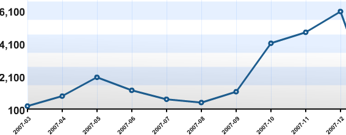

Il y a environ 1 an que je me suis mis à blogguer régulièrement, après avoir transféré mon ancien site sur WordPress, outil définitivement génial qui me permet de plus de récupérer quelques statistiques intéressantes, histoire de voir si tout se travail en vaut la peine:

- "Dr. Goulu" a reçu plus de 21'000 visiteurs en 1 an, et "décolle" surtout depuis septembre
  
  Les articles les plus consultés sont :
  1. [Ceci n'est pas un corps de femme ...](/2007/04/29/ceci-nest-pas-un-corps-de-femme/) a intéressé 1116 voyeurs
  2. 942 lecteurs ont consulté [La prolifération nucléaire est-elle évitable ?](/2007/09/21/la-proliferation-nucleaire-est-elle-evitable-2/)
  3. 756 ont voulu savoir [Comment faire 4 triangles équilatéraux avec 6 allumettes ?](/2007/01/26/comment-faire-4-triangles-equilateraux-avec-6-allumettes/)
  4. 703 étaient intéressés par [Les roues du TGV](/2007/04/03/les-roues-du-tgv/)
  5. 554 ont admiré l'[Illusion pour Yeux Bridés](/2007/06/27/illusion-pour-yeux-brides/)
  6. 450 ont lu mon analyse [Montre Mécanique contre Quartz](/2007/05/15/montre-mecanique-contre-quartz/)
  7. 430 sont intéressés par le [Calcul d’un ressort spiral d'horlogerie](/2005/12/12/calcul-dun-ressort-spiral-dhorlogerie/)
  8. 393 voulurent connaitre des [Sites de dessins rigolos](/2007/02/08/sites-de-dessins-rigolos/)
  9. 306 ont parcouru le [Chapitre 4 : Algorithmes et complexité](/2006/10/18/chapitre-4-algorithmes-et-complexite/) de mon (futur...) bouquin
  10. et 294 ont lu [le temps, une 4ème dimension imaginaire](/2007/02/07/le-temps-une-4eme-dimension-imaginaire/)
- [Foilers](http://foils.wordpress.com/)!, mon blog consacré à la vitesse à la voile a été consulté 26'000 fois, soit plus que Dr. Goulu, et la progression des visites est régulière.
  1. 1464 personnes ont heurté [Le mur des 50 noeuds](http://foils.wordpress.com/2007/03/09/le-mur-des-50-noeuds/)
  2. 1078 ont fait des bulles avec [La Cavitation](http://foils.wordpress.com/2007/03/10/cavitation/)
  3. 2 articles sur les planches à voile suivent avec 870 visites chacun : [Windsurf : ailerons et spinout](http://foils.wordpress.com/2007/07/06/windsurf-ailerons-et-spinout/) et [L'engin à voile le plus rapide sur l'eau](http://foils.wordpress.com/2007/03/10/finian-maynard/)
- [Watches!](http://horlogerie.wordpress.com/)a reçu 13'000 visites de passionnés d'horlogerie, en progression régulière également :
  1. [Théorie d'Horlogerie](http://horlogerie.wordpress.com/2007/03/31/theorie-dhorlogerie/) est l'article le plus lu, avec 836 visites
  2. Mes articules sur [Corum Golden Bridge](http://horlogerie.wordpress.com/2007/04/29/corum-golden-bridge/) , [Richard Mille](http://horlogerie.wordpress.com/2007/03/19/richard-mille/), [Jorg Hysek](http://horlogerie.wordpress.com/2007/06/17/jorg-hysek/) et [Master Compressor Extreme LAB](http://horlogerie.wordpress.com/2007/04/15/master-compressor-extreme-lab/) suivent avec environ 400 lecteurs pour chacun
- [mon blog perso+familial](https://goulu.wordpress.com/) n'a reçu "que" 5200 visites, ce qui est assez normal. Ce sont deux articles très "goulus" qui sont les plus consultés : la recette de la [Terrine aux deux saumons](http://goulu.wordpress.com/2007/08/16/terrine-aux-deux-saumons/) d'Annick (930) et l'article [Festival d'amuse-bouche](http://goulu.wordpress.com/2007/09/16/festival-damuse-bouche/) sur Denis Martin (572) font un meilleur score que [Mon CV](https://web.archive.org/web/20080113180253/http://goulu.wordpress.com/cv/) qui n'a intéressé que 400 personnes, alors que je cherche du boulot ... Devrais-je me recycler dans la gastronomie ?
- Avec 1600 visites seulement, [Web 2.0.0x](http://web200x.wordpress.com/) n'a pas atteint une audience encourageante. Probablement trop redondant avec des blogs à très forte audience, je vais peut-être le focaliser vers une cible plus étroite, comme le développement d'applications facebook ....
- [SWAPI](http://swapi.wordpress.com/), un "vieux" blog en anglais sur les API SolidWorks a reçu 6300 visites alors que je ne le maintiens presque plus. Peut-être devrais-je m'y remettre ?
- Avec 400 visites seulement, mon [blog religieux](http://pastafari.wordpress.com/) ferme la marche. Bande de mécréants ! Que l'an 008 de sa Savoureuseté soit pour vous l'Année ou Son Appendice Nouilleux vous touche enfin!
