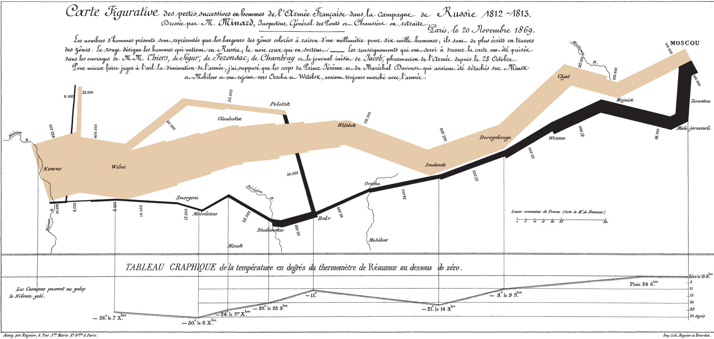

On commence l'année par une info pas très réjouissante : 400'000 français sont morts en Russie. Mais bon, c'était en hiver 1812, pendant la campagne napoléonienne... La raison d'en reparler, c'est la re-découverte de la carte/graphique statistique ci-dessous, oeuvre de M. Minard en 1869 (cliquer dessus pour l'agrandir) :

L'invasion se lit d'ouest en est, en suivant la bande colorée, dont la largeur est proportionnelle au nombre de soldats vivants à chaque étape. La retraite se lit de droite à gauche en suivant la bande noire qui rétrécit de 100'000 hommes à Moscou, puis à 20'000 avant la fameuse Bérézina où les rejoignent les 30'000 rescapés du détachement de 60'000 hommes envoyés vers Polotzk avant de se faire décimer, puisque 10'000 survivants seulement parviennent à ressortir vivants de cet enfer gelé.

La partie inférieure du graphique indique les températures auqxuelles cette malheureuse chair à canon à été exposée durant la retraite. Comme c'est des degrés Réaumur, il n'a fait "que" -16°C à partir du 9 novembre et jusqu'à -24°C le 6 décembre. Un mois à moins 20 ...

A ce sujet, j'avais appris au Collège (=Lycée) que l'étain dont étaient faits les boutons des uniformes napoléoniens devenait friable par grand froid, ouvrant les vêtements des soldats. je ne retrouve pas cette information sur le web, si quelqu'un a des précisions, ça m'intéresse...

### Sources:

- ["Vital Statistics of a Deadly Campaign: the Minard Map" sur strange maps](http://bigthink.com/ideas/21281) , un excellent blog consacré aux cartes et à la représentation de l'information
- ["Charts Worth a thousand words" sur Economist.com](http://www.economist.com/node/10278643?story_id=10278643) , article où d'autres cartes de ce type sont présentées
