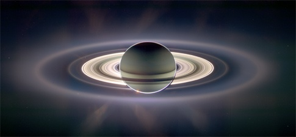
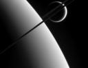

le [Cassini Favorite Image Contest](http://ciclops.org/contest07.php) a permis aux fans de la sonde Cassini (dont je suis) de voter pour les plus belles images prises par cet [extraordinaire engin qui visite les abords de Saturne](/2007/10/15/cassini-forever/).

Le premier prix a été décerné à cette incroyable image déjà mentionnée [ici](/2006/12/29/les-meilleures-photos-dastronomie-2006/) :

 _Saturne éclairée en arrière plan par le Soleil . La Terre est un petit point visible à travers les anneaux! (cliquez sur l'image pour l'agrandir)_

Dans la catégorie "noir & blanc" : deux images magnifiques, dont celle de Titan dans le plan des anneaux semble sortie d'un film de science fiction

Côté vidéo, le survol de [Japet](/2007/09/14/japet-de-saturne-par-cassini/) arrive juste derrière une traversée du plan des anneaux que je trouve personnellement moins bien

\[youtube DYvITG\_TDfE\]
