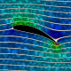
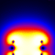
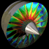
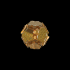
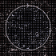
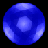
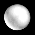
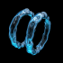
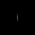
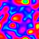

Depuis longtemps je suis un fan du [site de Paul "Bugman" Nylander](http://bugman123.com), un incroyable ramassis de choses épatantes sur des sujets comme la physique, les maths, les fractales et les papillons, le tout illustré par de magnifiques images et animations faites avec [Mathematica](http://www.wolfram.com/) et [POV-Ray](http://www.povray.org/) principalement.

Le seul problème est que ce site était devenu affreusement lourd, à la fois graphiquement et par la taille des énormes pages sur lesquelles on frisait l'indigestion à la première visite et on ne retrouvait plus rien à la seconde...

Je me suis donc mis à "forcer la main" de Paul en lui créant un [blog sur WordPress.com](http://nylander.wordpress.com/) qui lui a beaucoup plu, et sur lequel je vais l'aider à migrer tout son passionnant contenu.

Abonnez-vous à [ce flux RSS](http://nylander.wordpress.com/feed/) pour suivre toutes les choses merveilleuses qui vont être (re) publiées sur le blog deBugman, vous ne le regretterez pas !

Quelques exemples accessibles via les jolis gif animés ci dessous :

                        
