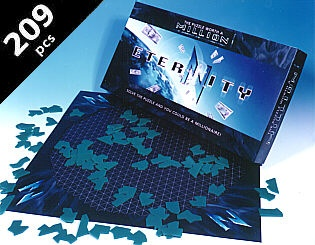
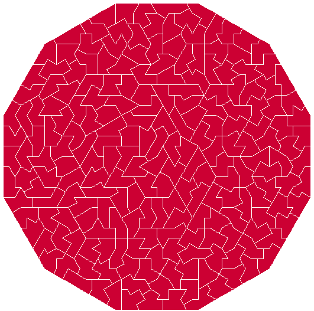
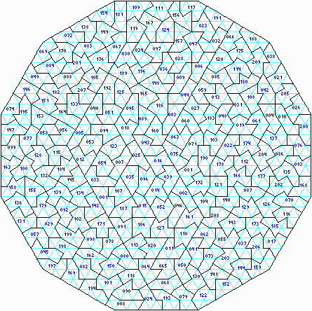
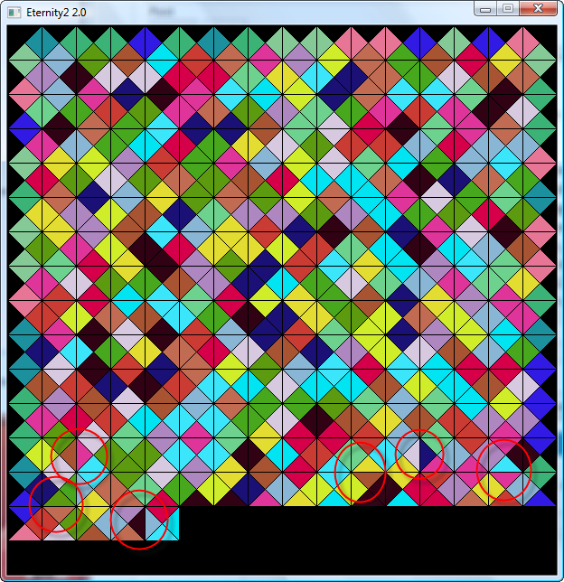



[Eternity II](http://fr.eternityii.com/) est un puzzle spécialement étudié pour être extrêmement difficile, au point que son éditeur offre [2 millions de dollars](http://fr.eternityii.com/regles-du-jeu/) au premier qui parviendra à placer correctement ses 256 pièces carrées de façon à ce que les côtés de chacune correspondent à ceux de ses 4 voisins, comme sur ce petit exemple avec 16 pièces seulement :



D'après l'éditeur, il existe 20'000 solutions au puzzle, et il nous "aide" en nous indiquant la position d'une pièce (la 139) , et fournit 2 indices de plus si l'on résout un puzzle 6x6 et un 12x6 avec des pièces indiquées dans la boite. Il n'est pas clair si ces indices ("hints" en anglais) facilitent réellement la résolution du puzzle, où s'ils servent à limiter le nombre de solutions admises comme victorieuses à beaucoup moins de 20'000, tout en rendant la programmation d'une solution informatique plus compliquée.

Mais avant d'attaquer la résolution informatique d'Eternity II, petit flash-back sur Eternity(I)

### Eternity

En 19xx, un challenge similaire avait été posé pour le puzzle "Eternity" premier du nom, dans lequel il fallait disposer 209 pièces dans un dodécagone. 2 solutions ont été trouvée, [la première](http://www.msoworld.com/mindzine/news/miscellany/eternity.html) en mai 2000 par [Alex Selby](http://www.archduke.org/eternity/index.html) et Oliver Riordon " et quelques ordinateurs", ce qui leur valut de se partager £1'000'000. Un mois plus tard, Guenter Stertenbrink a trouvé la seconde solution présentée ci-dessous:

 

A l'époque, Pierre-François avait programmé un logiciel de résolution du puzzle et l'avait rendu disponible sur le web à la condition de partager le prix avec lui si le programme permettait de trouver une solution. C'était une excellente idée, malheureusement il a du retirer son logiciel car il contenait la description des pièces du jeu, protégées par le copyright de l'éditeur ...

### Résolution informatique d'Eternity II

J'ai recensé plusieurs logiciels de résolution d'Eternity II, qui évitent tous ces problèmes de copyright en obligeant l'utilisateur à décrire lui-même les 256 pièces du jeu qu'il est censé avoir acheté au magasin :

1. [Eternity2.net](http://www.eternity2.fr/download) était le plus ambitieux : basé sur [BOINC](/2007/01/20/calcul-distribue-avec-boinc/) , il permettait d'utiliser la puissance combinée de milliers d'ordinateurs. Le projet a été [stoppé après quelques mois](http://www.bc-team.org/viewtopic.php?p=1665), officiellement par désespoir de trouver une solution avec un algorithme "brute force" et en raison des couts du serveur. Le code source de ce programme a été rendu disponible ... sur leur serveur qui ne répond plus !
2. [Eternity2.fr](http://www.eternity2.fr/) est aussi un solveur distribué, et le site (en français) est plein d'informations utiles, avec également un forum très actif. Le logiciel que vous téléchargez après inscription sur le site se synchronise avec le serveur pour calculer des configurations qui n'ont pas encore été évaluées. Si une solution est trouvée, l'auteur du logiciel s'engage à vous verser la moitié des $2M...
3. [GPU Eternity](http://gpu.sourceforge.net/eternity.php) est basé sur le "[Global Processing Unit](http://gpu.sourceforge.net/)", un client peer-to-peer [Gnutella](w:) qui non seulement partage les fichiers, mais aussi le processeur... Le [code source](http://gpu.cvs.sourceforge.net/gpu/gpu_solar/src/dllbuilding/eternity2/) en Delphi de ce projet est disponible, ce qui est intéressant pour voir comment il est fait ...
4. [Tetravex II](http://www.tetravexii.com/) est un shareware à $10 qui vous propose de garder les $2M pour vous tout seul, mais n'utilise qu'un seul processeur pour faire tourner un algorithme présenté comme mystérieusement exclusif, mais dont les résultats montrent qu'il est très "brute force" (voir ci-dessous)
5. Il y a un code source en C++ [ici](http://www.squaro.fr/e2/)
6. et un en Java [ici](https://github.com/AntonFagerberg/Eternity-II-Puzzle-Solver). _(lien restauré le 19.3.2015)_

#### Algorithmes utilisés

Tous ces programmes utilisent faute de mieux un approche "brute force" : on place des pièces correspondantes les unes à côté des autres jusqu'à ce qu'on ne puisse plus le faire, puis on fait du "backtracking" en enlevant la dernière pièce et en essayant d'en mettre une autre qui permette de continuer, et si on n'y arrive pas on enlève encore la pièce précédente etc. La [complexité](/2006/10/18/chapitre-4-algorithmes-et-complexite/) de cet algorithme est monstrueuse : la probabilité de trouver une solution de cette manière en une année est très faible.

[Eternity2.fr](http://www.eternity2.fr/) annnonce une performance de son algorithme de 15'000'000 de pièces disposées / seconde ! Une option permet de visualiser son fonctionnement dans une fenêtre graphique bougeant à toute vitesse. Une capture donne ceci :

On voit que, comme souvent dans ce genre de casse-tête, tout va bien presque jusqu'à la fin : ce sont les dernières pièces qui font la différence, et si on n'y arrive pas, c'est peut être les premières qui sont mal placées ...

Un petit doute me tarabuste à propos d'Eternity2.fr : les anomalies cerclées de rouge : avec un vrai programme de backtracking, il ne devrait pas y avoir de pièce mal placée dans le puzzle. Peut-être est-ce un problème graphique, l'affichage étant partiellement désynchronisé ...

Tetravex II a aussi une interface graphique et aborde le problème de manière identique, ligne par ligne. Je me demande si c'est judicieux car les pièces formant les bords sont connues, donc autant tenter de les placer le plus tôt possible, non ?

Je vais encore y réfléchir et peut-être me lancer dans un solveur moins "brute force"...

#### Références:

- [page sur Eternity2.net du Portail de L'Alliance Francophone des projets BOINC](http://www.boinc-af.org/content/view/711/278/)
- [ETERNITY II - UN PUZZLE QUI PEUT VOUS RAPPORTER 1.45 MILLION D’EURO!](http://www.vox-populi.net/article.php3?id_article=457) sur Vox-Populi
