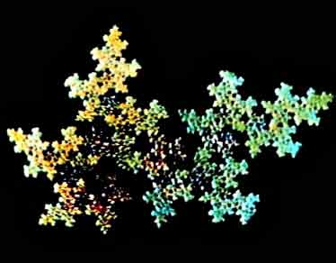
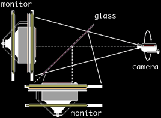

Sur le [blog de Bugman](http://bugman123.com), je suis tombé sur ce lien : [Video Feedback Fractals](http://www.sweetandfizzy.com/fractals/index.html) qui décrit une technique permettant d'obtenir des "fractales" en temps réel avec une caméra vidéo, sans logiciel particulier.

On obtient des images comme celle ci-dessus à l'aide du montage suivant :

sur les moniteurs, on ne fait rien d'autres que d'afficher l'image prise par la caméra... Il s'agit d'une version améliorée de ce qu'on peut féjà obtenir avec une simple webcam :

\[youtube uzzktnjKkVg\]
