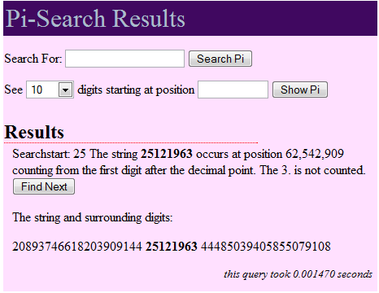

Un nouveau moteur de recherche particulièrement inutile mais génialement merveilleux fait fureur sur internet : [Pi-Search](http://www.angio.net/pi/bigpi.cgi)

Il cherche une séquence de décimales dans les 200'000'000 premières décimales de pi . Par exemple, avec ma date de naissance ça donne :

Ceux qui savent ce qu'est un algorithme (et que ça ne s'écrit pas avec Y ...), remarqueront que trouver une séquence dans 200 millions de caractères en 1.5 millisecondes (sur un Pentium 4!) demande un peu de subtilité. Dave Andersen explique [ici comment il fait](http://www.angio.net/pi/how.html).

### Voir aussi:

- [Histoire du calcul de Pi](/2005/11/06/histoire-du-calcul-de-pi/ "Histoire du calcul de Pi")
- [15000 décimales de Pi en 133 octets de C](/2004/06/28/pi-en-c/ "15000 décimales de Pi en 133 octets de C")
