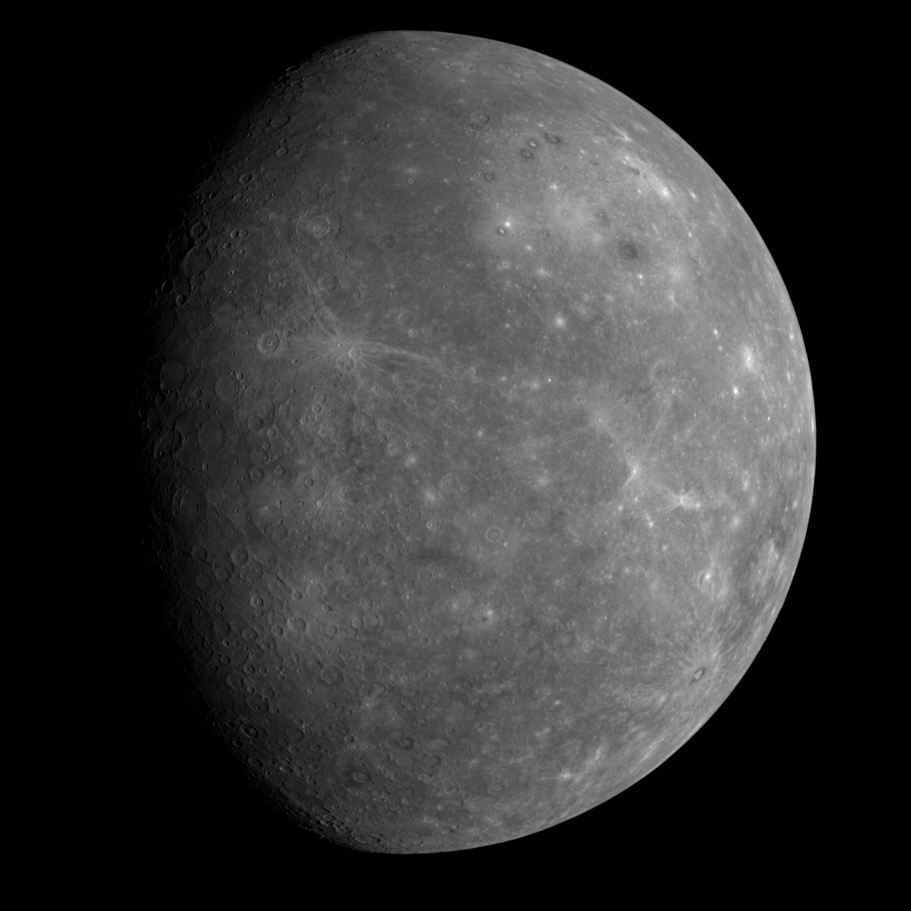
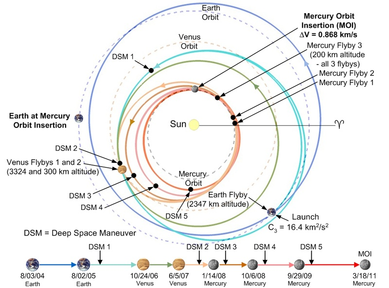

[Mercure](http://fr.wikipedia.org/wiki/Mercure_%28plan%C3%A8te%29) est la planète la plus proche du Soleil, et, bien qu'elle soit beaucoup moins éloignée de nous que Jupiter, elle a n'a été visitée par des sondes automatiques que 2 fois : par "[Mariner 10](http://fr.wikipedia.org/wiki/Mariner_10)" en 1974 et par "[Messenger](http://fr.wikipedia.org/wiki/Programme_Messenger)", qui vient d'y faire un premier passage et se mettra en orbite autour de cette petite planète pour la scruter en détail en 2011.

Les photos déjà prises par Messenger ravissent les spécialistes, mais pour le néophyte elles ne montrent pas beaucoup plus que celles fournies par son ancètre : Mercure est littéralement criblée de cratères de toutes tailles:

Ce qui me parait plus intéressant, c'est la complexité de la trajectoire de Messenger, représentée sur le graphique ci dessous (cliquer dessus pour l'agrandir) :

Ca parait paradoxal, mais il est plus difficile de se mettre en orbite autour de Mercure que de Jupiter par exemple, pour deux raisons :

1. Lancée depuis la Terre, la sonde tourne autour du Soleil à peu près à la même vitesse que notre planète, soit 29.78 km/s. Il faut la freiner énormément pour la faire "tomber" en direction du Soleil, et de puissants moteurs ne sont pas suffisants pour ceci. Si on part vers Jupiter, il "suffit" d'accélérer un peu et d'être patient.
2. Mercure étant une petite planète, son attraction est trop faible pour capturer une sonde qui passerait par là. Il faut en réalité mettre Messenger en orbite autour du Soleil sur la même orbite que Mercure à un pouième près pour que Messenger se mettre à orbiter autour de Mercure, qui tourne autour du Soleil beaucoup plus vite que la Terre, à 47,36 km/s

Pour se retrouver sur la bonne orbite, Messenger doit exploiter "à l'envers" l'effet de fronde habituellement utilisé pour propulser les Voyager, Cassini et autres explorateurs des planètes extérieures. Faute de planètes massives (Jupiter est une excellente fronde pour aller vers Saturne et au delà), Messenger est repassée près de la Terre en 2005, un an après son lancement, puis près de Vénus en 2006 et 2007, et vient donc de passer pour la première fois près de Mercure. Mais l'orbite de Messenger est encore très elliptique et l'emmènera presque jusqu'à celle de Venus. Il faudra encore deux passages près de Mercure en octobre 2008 et fin septembre 2009 entrecoupés d'utilisations bien pensées des moteurs (notés "DSM" sur le graphique) pour arriver au but : le 18 mars 2011, Mercure aura un satellite doté de nombreux instruments de mesure.

### Source :

- [Futura-Sciences : les photos du survol de Mercure par la sonde Messenger](http://www.techno-science.net/?onglet=news&news=4969)
