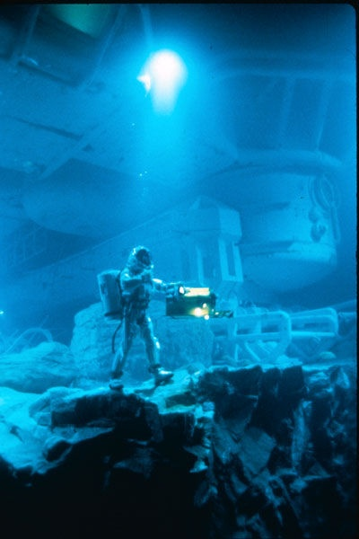

### Gaz

Dès quelques dizaines de mètres de profondeur la pression permet à l'azote, qui compose 75% de l'air, de traverser les parois pulmonaires en même temps que l'oxygène et de se dissoudre dans le sang. En remontant trop vite, l'azote fait des bulles lors de la décompression, et ce n'est pas bon du tout pour la santé. De plus, à partir de 30m déjà mais surtout dès 60m, l'azote devient un narcotique.

Pour plonger plus profond, il faut remplacer l'azote par de l'hélium. Mais dès 120m, l'hélium provoque le "syndrome nerveux des hautes pressions" et il faut se mettre à respirer un mélange d'hydrogène et d'oxygène, qui a permis aux plongeurs très professionnels de la Comex de travailler une semaine à 500m, et d'atteindre l'équivalent de 700m dans un caisson hyperbare de laboratoire.

Peut-on aller plus bas sans devoir s'enfermer dans un sous-marin ? et remonter sans passer des semaines en paliers de décompression ?

### Liquide

Dans le superbe film [Abyss](http://www.allocine.fr/film/fichefilm_gen_cfilm=4992.html), un plongeur descend à plus de 3000m en respirant un liquide, ce qui lui permet d'être insensible à la pression. Est-ce possible ? Et bien oui, d'ailleurs la scène du film dans laquelle un rat est immergé dans ce produit n'est pas truquée, et le rat n'est pas mort des suites de cette expérience.

D'après le forum "[Respirer un autre fluide que l'oxygène?](http://forums.futura-sciences.com/biologie/42479-respirer-un-fluide-loxygene.html)" le liquide est du perfluorooctylbromure (PFOB) . Il appartient à la famille des perfluoroalcanes, et on peut y dissoudre beaucoup d'oxygène (52.7 ml dans 100ml de liquide). Selon une récente [émission de Thalassa](http://www.thalassa.france3.fr/index-fr.php?page=emission&id_rubrique=22), ce produit a même été testé sur un prisonnier américain plus ou moins volontaire. Le PFOB est maintenant envisagé pour des applications médicales, entre autres sous le nom de [LiquiVent](http://www.allp.com/LiquiVent/lv_fact.htm), mais officiellement, l'armée US a cessé de s'intéresser à ce liquide pour la plongée profonde... Pourquoi donc ?

### Sources:

- "[plongée sous-marine](w:)" sur Wikipedia
- forum "[Respirer un autre fluide que l'oxygène?](http://forums.futura-sciences.com/biologie/42479-respirer-un-fluide-loxygene.html)" sur Futura-Sciences, avec infos très complètes de "fafapas"
